# Using the Phyloseq package

The phyloseq package is fast becoming a good way a managing micobial community data, filtering and visualizing that data and performing analysis such as ordination. Along with the standard R environment and packages vegan and vegetarian you can perform virtually any analysis. Today we will

1. Load data straight from dbcAmplicons (biom file)
2. Filter out Phylum
3. Filter out additional Taxa
4. Filter out samples
5. Graphical Summaries
6. Ordination
7. Differential Abundances

## Load our libraries


```r
library(phyloseq)
library(biomformat)
library(ggplot2)
library(gridExtra)
library(vegan)
```

```
## Loading required package: permute
```

```
## Loading required package: lattice
```

```
## This is vegan 2.5-6
```

```r
library(edgeR)
```

```
## Loading required package: limma
```

## Read in the dataset, biom file generated from dbcAmplicons pipeline

First read in the dataset, see what the objects look like. Our Biom file, produces 3 tables: otu_table, taxa_table, sample_data. Look at the head of each. Get the sample names and tax ranks, finally view the phyloseq object. Lets draw a first bar plot.


```r
s16sV3V5 = import_biom(BIOMfilename = "16sV3V5.biom", parseFunction = parse_taxonomy_default)

# this changes the columns names to kingdon through genus
colnames(tax_table(s16sV3V5)) <- c("Kingdom", "Phylum", "Class", "Order", "Family", "Genus")

head(otu_table(s16sV3V5))
```

```
## OTU Table:          [6 taxa and 48 samples]
##                      taxa are rows
##            sample1 sample10 sample11 sample12 sample13 sample14 sample15
## Taxa_00000    2144     2303     3235     2895     2584     2465     2907
## Taxa_00001       0        0        0        0        0        0        0
## Taxa_00002      29       18       40       36       33       42       37
## Taxa_00003      14       18       16       16       36       21       32
## Taxa_00004     142      138      214      136       88      132      148
## Taxa_00005       3       14       15       16        7       10        7
##            sample16 sample17 sample18 sample19 sample2 sample20 sample21
## Taxa_00000     2651     2751     3022     2904    3034     2547     2908
## Taxa_00001        0        0        0        0       0        0        0
## Taxa_00002       35       42       25       40      19       43       34
## Taxa_00003       23       19       12       16      37       25       13
## Taxa_00004      140      141      131      109     140      227      227
## Taxa_00005        6        6        4        8      12        3        9
##            sample22 sample23 sample24 sample25 sample26 sample27 sample28
## Taxa_00000     1946     2790     2146     2291     2046     2283     2292
## Taxa_00001        0        0        0        0        0        0        0
## Taxa_00002       24       32       33       23       23       21       26
## Taxa_00003       14       15       20       15       16       11       20
## Taxa_00004       90      161      105      135      104       93       99
## Taxa_00005       10        3        3       10        3       13        4
##            sample29 sample3 sample30 sample31 sample32 sample33 sample34
## Taxa_00000     2349    2483     2126     2336     2576     2478     1909
## Taxa_00001        0       0        0        0        0        0        0
## Taxa_00002       34      22       27       33       33       26       28
## Taxa_00003       27      21       14       18       23       12       16
## Taxa_00004      137     163      188      107      200       99      176
## Taxa_00005        1       5        7        8       12        6        5
##            sample35 sample36 sample37 sample38 sample39 sample4 sample40
## Taxa_00000     2666     2672     2605     2403     2552    2795     2073
## Taxa_00001        0        0        0        0        0       0        0
## Taxa_00002       36       28       19       34       28      39       28
## Taxa_00003       30       28       19       15       31      17       22
## Taxa_00004      319      202      271      203      170     133       89
## Taxa_00005        2        8        3        0        6       7        8
##            sample41 sample42 sample43 sample44 sample45 sample46 sample47
## Taxa_00000     2519     3647     3352     3559     3270     2337     2835
## Taxa_00001        0        0        0        0        0        0        0
## Taxa_00002       30       44       34       41       29       28       21
## Taxa_00003       14       39       21       28       31       17       28
## Taxa_00004      160      212      222      284      236      178      187
## Taxa_00005        2       10        8        4        5       10        8
##            sample48 sample5 sample6 sample7 sample8 sample9
## Taxa_00000     2258    2214    3315    3078    2848    3107
## Taxa_00001        0       0       0       1       0       0
## Taxa_00002       29      28      27      35      32      35
## Taxa_00003       25      26      33      27      34      24
## Taxa_00004      146     195     185     399     310     241
## Taxa_00005        6       3      12       4       3       2
```

```r
head(sample_data(s16sV3V5))
```

```
##           primers Replicate   Treatment Timepoint
## sample1  16S_V3V5         4 ABC_Control        T1
## sample10 16S_V3V5         1     Control        T2
## sample11 16S_V3V5         2     Control        T2
## sample12 16S_V3V5         3     Control        T2
## sample13 16S_V3V5         4     Control        T2
## sample14 16S_V3V5         1  Condition1        T2
```

```r
head(tax_table(s16sV3V5))
```

```
## Taxonomy Table:     [6 taxa by 6 taxonomic ranks]:
##            Kingdom       Phylum            
## Taxa_00000 "d__Bacteria" NA                
## Taxa_00001 "d__Bacteria" "p__Acetothermia" 
## Taxa_00002 "d__Bacteria" "p__Acidobacteria"
## Taxa_00003 "d__Bacteria" "p__Acidobacteria"
## Taxa_00004 "d__Bacteria" "p__Acidobacteria"
## Taxa_00005 "d__Bacteria" "p__Acidobacteria"
##            Class                                  
## Taxa_00000 NA                                     
## Taxa_00001 "c__Acetothermia_genera_incertae_sedis"
## Taxa_00002 NA                                     
## Taxa_00003 "c__Acidobacteria_Gp1"                 
## Taxa_00004 "c__Acidobacteria_Gp10"                
## Taxa_00005 "c__Acidobacteria_Gp11"                
##            Order                                  
## Taxa_00000 NA                                     
## Taxa_00001 "o__Acetothermia_genera_incertae_sedis"
## Taxa_00002 NA                                     
## Taxa_00003 NA                                     
## Taxa_00004 "o__Gp10"                              
## Taxa_00005 "o__Gp11"                              
##            Family                                 
## Taxa_00000 NA                                     
## Taxa_00001 "f__Acetothermia_genera_incertae_sedis"
## Taxa_00002 NA                                     
## Taxa_00003 NA                                     
## Taxa_00004 "f__Gp10"                              
## Taxa_00005 "f__Gp11"                              
##            Genus                                  
## Taxa_00000 NA                                     
## Taxa_00001 "g__Acetothermia_genera_incertae_sedis"
## Taxa_00002 NA                                     
## Taxa_00003 NA                                     
## Taxa_00004 "g__Gp10"                              
## Taxa_00005 "g__Gp11"
```

```r
rank_names(s16sV3V5)
```

```
## [1] "Kingdom" "Phylum"  "Class"   "Order"   "Family"  "Genus"
```

```r
sample_variables(s16sV3V5)
```

```
## [1] "primers"   "Replicate" "Treatment" "Timepoint"
```

```r
s16sV3V5
```

```
## phyloseq-class experiment-level object
## otu_table()   OTU Table:         [ 1344 taxa and 48 samples ]
## sample_data() Sample Data:       [ 48 samples by 4 sample variables ]
## tax_table()   Taxonomy Table:    [ 1344 taxa by 6 taxonomic ranks ]
```

```r
plot_bar(s16sV3V5, fill = "Phylum") + theme(legend.position="bottom" ) +  scale_fill_manual(values = rainbow(length(unique(tax_table(s16sV3V5)[,"Phylum"]))-1))
```

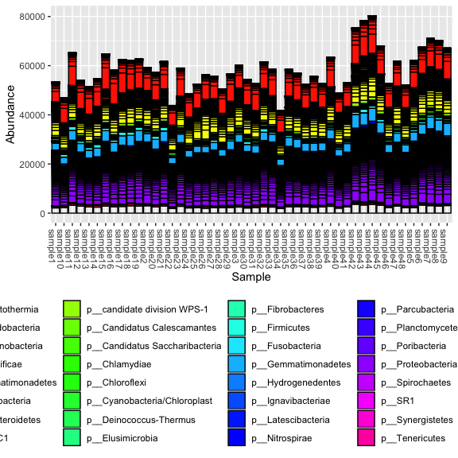<!-- -->

## Filtering our dataset

First lets remove of the feature with ambiguous phylum annotation.


```r
s16sV3V5 <- subset_taxa(s16sV3V5, !is.na(Phylum) & !Phylum %in% c("", "uncharacterized"))
s16sV3V5
```

```
## phyloseq-class experiment-level object
## otu_table()   OTU Table:         [ 1342 taxa and 48 samples ]
## sample_data() Sample Data:       [ 48 samples by 4 sample variables ]
## tax_table()   Taxonomy Table:    [ 1342 taxa by 6 taxonomic ranks ]
```

Lets generate a prevelance table (number of samples each taxa occurs in) for each taxa.

```r
prevelancedf = apply(X = otu_table(s16sV3V5),
                 MARGIN = 1,
                 FUN = function(x){sum(x > 0)})
# Add taxonomy and total read counts to this data.frame
prevelancedf = data.frame(Prevalence = prevelancedf,
                      TotalAbundance = taxa_sums(s16sV3V5),
                      tax_table(s16sV3V5))
colnames(prevelancedf) <- c("Prevalence", "TotalAbundance", colnames(tax_table(s16sV3V5)))

prevelancedf[1:10,]
```

```
##            Prevalence TotalAbundance     Kingdom           Phylum
## Taxa_00001          1              1 d__Bacteria  p__Acetothermia
## Taxa_00002         48           1483 d__Bacteria p__Acidobacteria
## Taxa_00003         48           1049 d__Bacteria p__Acidobacteria
## Taxa_00004         48           8312 d__Bacteria p__Acidobacteria
## Taxa_00005         47            321 d__Bacteria p__Acidobacteria
## Taxa_00006         23             34 d__Bacteria p__Acidobacteria
## Taxa_00007          8             13 d__Bacteria p__Acidobacteria
## Taxa_00008         48           1356 d__Bacteria p__Acidobacteria
## Taxa_00009         48           7213 d__Bacteria p__Acidobacteria
## Taxa_00010         48           2285 d__Bacteria p__Acidobacteria
##                                            Class
## Taxa_00001 c__Acetothermia_genera_incertae_sedis
## Taxa_00002                                  <NA>
## Taxa_00003                  c__Acidobacteria_Gp1
## Taxa_00004                 c__Acidobacteria_Gp10
## Taxa_00005                 c__Acidobacteria_Gp11
## Taxa_00006                 c__Acidobacteria_Gp12
## Taxa_00007                 c__Acidobacteria_Gp13
## Taxa_00008                 c__Acidobacteria_Gp15
## Taxa_00009                 c__Acidobacteria_Gp16
## Taxa_00010                 c__Acidobacteria_Gp17
##                                            Order
## Taxa_00001 o__Acetothermia_genera_incertae_sedis
## Taxa_00002                                  <NA>
## Taxa_00003                                  <NA>
## Taxa_00004                               o__Gp10
## Taxa_00005                               o__Gp11
## Taxa_00006                               o__Gp12
## Taxa_00007                               o__Gp13
## Taxa_00008                               o__Gp15
## Taxa_00009                               o__Gp16
## Taxa_00010                               o__Gp17
##                                           Family
## Taxa_00001 f__Acetothermia_genera_incertae_sedis
## Taxa_00002                                  <NA>
## Taxa_00003                                  <NA>
## Taxa_00004                               f__Gp10
## Taxa_00005                               f__Gp11
## Taxa_00006                               f__Gp12
## Taxa_00007                               f__Gp13
## Taxa_00008                               f__Gp15
## Taxa_00009                               f__Gp16
## Taxa_00010                               f__Gp17
##                                            Genus
## Taxa_00001 g__Acetothermia_genera_incertae_sedis
## Taxa_00002                                  <NA>
## Taxa_00003                                  <NA>
## Taxa_00004                               g__Gp10
## Taxa_00005                               g__Gp11
## Taxa_00006                               g__Gp12
## Taxa_00007                               g__Gp13
## Taxa_00008                               g__Gp15
## Taxa_00009                               g__Gp16
## Taxa_00010                               g__Gp17
```

### Whole phylum filtering

Now lets investigate low prevelance/abundance phylum and subset them out.


```r
summary_prevalence <- plyr::ddply(prevelancedf, "Phylum", function(df1){
  data.frame(mean_prevalence=mean(df1$Prevalence),total_abundance=sum(df1$TotalAbundance,na.rm = T),stringsAsFactors = F)
})
summary_prevalence
```

```
##                            Phylum mean_prevalence total_abundance
## 1                 p__Acetothermia         1.00000               1
## 2                p__Acidobacteria        35.72973          521716
## 3               p__Actinobacteria        23.36910          171632
## 4                    p__Aquificae        15.00000              72
## 5              p__Armatimonadetes        33.57143            2966
## 6                 p__Atribacteria         8.00000              10
## 7                p__Bacteroidetes        24.49618          451903
## 8                         p__BRC1        48.00000             451
## 9     p__candidate division WPS-1        48.00000           40707
## 10    p__Candidatus Calescamantes         1.00000               1
## 11 p__Candidatus Saccharibacteria        48.00000           14731
## 12                  p__Chlamydiae        20.50000             514
## 13                 p__Chloroflexi        33.51724           54899
## 14   p__Cyanobacteria/Chloroplast        23.84615            3738
## 15         p__Deinococcus-Thermus         3.75000              19
## 16               p__Elusimicrobia        25.33333             208
## 17               p__Fibrobacteres        25.00000             496
## 18                  p__Firmicutes        13.02542           67371
## 19                p__Fusobacteria         1.00000               2
## 20            p__Gemmatimonadetes        48.00000          174765
## 21             p__Hydrogenedentes        33.00000              90
## 22             p__Ignavibacteriae        31.33333             447
## 23             p__Latescibacteria        48.00000             471
## 24                 p__Nitrospirae        25.00000           25979
## 25               p__Parcubacteria        48.00000             477
## 26              p__Planctomycetes        37.86364           19036
## 27                p__Poribacteria         9.00000              13
## 28              p__Proteobacteria        25.16216         1090361
## 29                p__Spirochaetes        14.12500             424
## 30                         p__SR1        14.00000              24
## 31               p__Synergistetes         3.25000              13
## 32                 p__Tenericutes         7.50000              57
## 33       p__Thermodesulfobacteria         9.00000              14
## 34                 p__Thermotogae         1.00000               2
## 35             p__Verrucomicrobia        33.40909           43057
```

Using the table above, determine the phyla to filter

```r
sum(summary_prevalence$total_abundance)*0.001
```

```
## [1] 2686.667
```

```r
table(summary_prevalence$total_abundance/sum(summary_prevalence$total_abundance) >= 0.001)
```

```
## 
## FALSE  TRUE 
##    21    14
```

```r
keepPhyla <- summary_prevalence$Phylum[summary_prevalence$total_abundance/sum(summary_prevalence$total_abundance) >= 0.001]

s16sV3V5.1 = subset_taxa(s16sV3V5, Phylum %in% keepPhyla)
summary_prevalence <- summary_prevalence[summary_prevalence$Phylum %in% keepPhyla,]
summary_prevalence
```

```
##                            Phylum mean_prevalence total_abundance
## 2                p__Acidobacteria        35.72973          521716
## 3               p__Actinobacteria        23.36910          171632
## 5              p__Armatimonadetes        33.57143            2966
## 7                p__Bacteroidetes        24.49618          451903
## 9     p__candidate division WPS-1        48.00000           40707
## 11 p__Candidatus Saccharibacteria        48.00000           14731
## 13                 p__Chloroflexi        33.51724           54899
## 14   p__Cyanobacteria/Chloroplast        23.84615            3738
## 18                  p__Firmicutes        13.02542           67371
## 20            p__Gemmatimonadetes        48.00000          174765
## 24                 p__Nitrospirae        25.00000           25979
## 26              p__Planctomycetes        37.86364           19036
## 28              p__Proteobacteria        25.16216         1090361
## 35             p__Verrucomicrobia        33.40909           43057
```

```r
s16sV3V5.1
```

```
## phyloseq-class experiment-level object
## otu_table()   OTU Table:         [ 1290 taxa and 48 samples ]
## sample_data() Sample Data:       [ 48 samples by 4 sample variables ]
## tax_table()   Taxonomy Table:    [ 1290 taxa by 6 taxonomic ranks ]
```

### Individual Taxa Filtering

Subset to the remaining phyla by prevelance.

```r
prevelancedf1 = subset(prevelancedf, Phylum %in% get_taxa_unique(s16sV3V5.1, taxonomic.rank = "Phylum"))
ggplot(prevelancedf1, aes(TotalAbundance,Prevalence / nsamples(s16sV3V5.1),color=Phylum)) +
  # Include a guess for parameter
  geom_hline(yintercept = 0.10, alpha = 0.5, linetype = 2) + geom_point(size = 2, alpha = 0.7) +
  scale_x_log10() +  xlab("Total Abundance") + ylab("Prevalence [Frac. Samples]") +
  facet_wrap(~Phylum) + theme(legend.position="none")
```

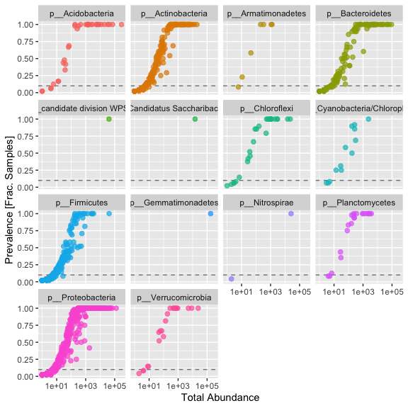<!-- -->

Sometimes you see a clear break, however we aren't seeing one here. In this case I'm moslty interested in those organisms consistantly present in the dataset, so I'm removing all taxa present in less than 50% of samples.


```r
#  Define prevalence threshold as 10% of total samples ~ set of replicates
prevalenceThreshold = 0.10 * nsamples(s16sV3V5.1)
prevalenceThreshold
```

```
## [1] 4.8
```

```r
# Execute prevalence filter, using `prune_taxa()` function
keepTaxa = rownames(prevelancedf1)[(prevelancedf1$Prevalence >= prevalenceThreshold)]
length(keepTaxa)
```

```
## [1] 932
```

```r
s16sV3V5.2 = prune_taxa(keepTaxa, s16sV3V5.1)
s16sV3V5.2
```

```
## phyloseq-class experiment-level object
## otu_table()   OTU Table:         [ 932 taxa and 48 samples ]
## sample_data() Sample Data:       [ 48 samples by 4 sample variables ]
## tax_table()   Taxonomy Table:    [ 932 taxa by 6 taxonomic ranks ]
```

Agglomerate taxa at the Genus level (combine all with the same name) keeping all taxa without genus level assignment

```r
length(get_taxa_unique(s16sV3V5.2, taxonomic.rank = "Genus"))
```

```
## [1] 759
```

```r
s16sV3V5.3 = tax_glom(s16sV3V5.2, "Genus", NArm = FALSE)
s16sV3V5.3
```

```
## phyloseq-class experiment-level object
## otu_table()   OTU Table:         [ 932 taxa and 48 samples ]
## sample_data() Sample Data:       [ 48 samples by 4 sample variables ]
## tax_table()   Taxonomy Table:    [ 932 taxa by 6 taxonomic ranks ]
```

```r
## out of curiosity how many "reads" does this leave us at???
sum(colSums(otu_table(s16sV3V5.3)))
```

```
## [1] 2682008
```

## Now lets filter out samples (outliers and low performing samples)

Do some simple ordination looking for outlier samples, first we variance stabilize the data with a log transform, the perform PCoA using bray's distances

```r
logt  = transform_sample_counts(s16sV3V5.3, function(x) log(1 + x) )
out.pcoa.logt <- ordinate(logt, method = "MDS", distance = "bray")
evals <- out.pcoa.logt$values$Eigenvalues
plot_ordination(logt, out.pcoa.logt, type = "samples",
                color = "Treatment", shape = "Timepoint") + labs(col = "Treatment") +
                coord_fixed(sqrt(evals[2] / evals[1]))
```

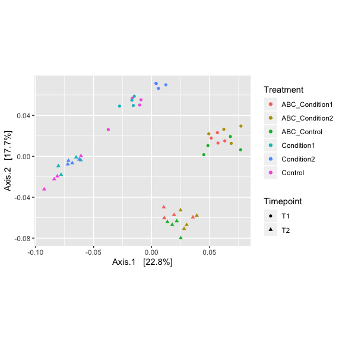<!-- -->

You could also use the MDS method of ordination here, edit the code to do so. Can also edit the distance method used to jaccard, jsd, euclidean. Play with changing those parameters


```r
#Can view the distance method options with
?distanceMethodList

# can veiw the oridinate methods with
?ordinate
```

Show taxa proportions per sample (quickplot)

```r
grid.arrange(nrow = 3,
qplot(as(otu_table(logt),"matrix")[, "sample1"], geom = "histogram", bins=30) +
  xlab("Relative abundance"),

qplot(as(otu_table(logt),"matrix")[, "sample34"], geom = "histogram", bins=30) +
  xlab("Relative abundance"),

qplot(as(otu_table(logt),"matrix")[, "sample44"], geom = "histogram", bins=30) +
  xlab("Relative abundance")
)
```

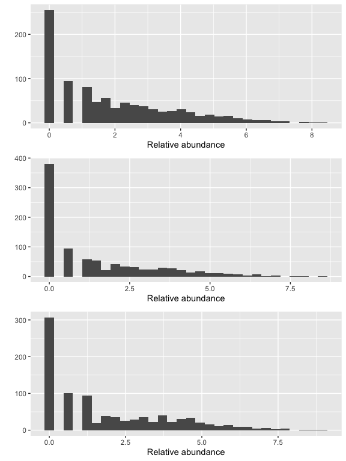<!-- -->

```r
# if you needed to remove candidate outliers, can use the below to remove sample Slashpile18
#s16sV3V5.pruned <- prune_samples(sample_names(s16sV3V5.3) != c("sample1","sample2"), s16sV3V5.3)
```

Look for low perfroming samples

```r
qplot(colSums(otu_table(s16sV3V5.3)),bins=30) + xlab("Logged counts-per-sample")
```

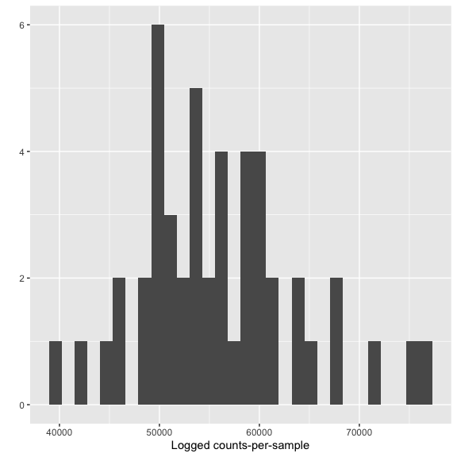<!-- -->

```r
s16sV3V5.4 <- prune_samples(sample_sums(s16sV3V5.3)>=10000, s16sV3V5.3)
s16sV3V5.4
```

```
## phyloseq-class experiment-level object
## otu_table()   OTU Table:         [ 932 taxa and 48 samples ]
## sample_data() Sample Data:       [ 48 samples by 4 sample variables ]
## tax_table()   Taxonomy Table:    [ 932 taxa by 6 taxonomic ranks ]
```

Investigate transformations. We transform microbiome count data to account for differences in library size, variance, scale, etc.

* RLE -  is the scaling factor method proposed by Anders and Huber (2010). We call it “relative log expression”, as median library is calculated from the geometric mean of all columns and the median ratio of each sample to the median library is taken as the scale factor.


```r
## for Firmictures
plot_abundance = function(physeq, meta, title = "",
			     Facet = "Order", Color = "Order"){
  # Arbitrary subset, based on Phylum, for plotting
  p1f = subset_taxa(physeq, Phylum %in% c("p__Firmicutes"))
  mphyseq = psmelt(p1f)
  mphyseq <- subset(mphyseq, Abundance > 0)
  ggplot(data = mphyseq, mapping = aes_string(x = meta,y = "Abundance",
                                 color = Color, fill = Color)) +
    geom_violin(fill = NA) +
    geom_point(size = 1, alpha = 0.3,
                position = position_jitter(width = 0.3)) +
    facet_wrap(facets = Facet) + scale_y_log10()+
    theme(legend.position="none")
}

# transform counts into "relative abundances"
s16sV3V5.4ra = transform_sample_counts(s16sV3V5.4, function(x){x / sum(x)})

# transform counts into "hellinger standardized counts"
s16sV3V5.4hell <- s16sV3V5.4
otu_table(s16sV3V5.4hell) <- otu_table(decostand(otu_table(s16sV3V5.4hell), method = "hellinger"), taxa_are_rows=TRUE)

# RLE counts
s16sV3V5.4RLE <- s16sV3V5.4
RLE_normalization <- function(phyloseq){
  prior.count = 1
  count_scale = median(sample_sums(phyloseq))
  m = as(otu_table(phyloseq), "matrix")
  d = DGEList(counts=m, remove.zeros = FALSE)
  z = calcNormFactors(d, method="RLE")
  y <- as.matrix(z)
  lib.size <- z$samples$lib.size * z$samples$norm.factors
  ## rescale to median sample count
  out <- round(count_scale * sweep(y,MARGIN=2, STATS=lib.size,FUN = "/"))
  dimnames(out) <- dimnames(y)
  out
}
otu_table(s16sV3V5.4RLE) <- otu_table(RLE_normalization(s16sV3V5.4), taxa_are_rows=TRUE)
s16sV3V5.4logRLE = transform_sample_counts(s16sV3V5.4RLE, function(x){ log2(x +1)})

plotOriginal = plot_abundance(s16sV3V5.4, "Treatment", title="original")
plotRelative = plot_abundance(s16sV3V5.4ra, "Treatment", title="relative")
plotHellinger = plot_abundance(s16sV3V5.4hell, "Treatment", title="Hellinger")
plotLogRLE = plot_abundance(s16sV3V5.4logRLE, "Treatment", title="Log")
# Combine each plot into one graphic.
grid.arrange(nrow = 4, plotOriginal, plotRelative, plotHellinger, plotLogRLE)
```

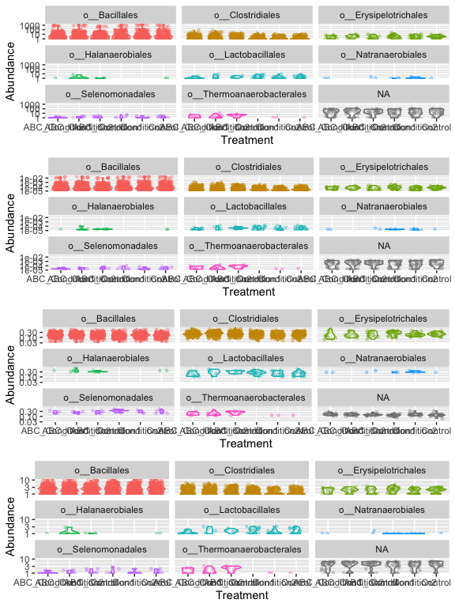<!-- -->

[Normalization and microbial differential abundance strategies depend upon data characteristics]
(https://microbiomejournal.biomedcentral.com/articles/10.1186/s40168-017-0237-y)


```r
plot_richness(s16sV3V5.4RLE, measures=c("Observed","Chao1"))
```

```
## Warning: Removed 48 rows containing missing values (geom_errorbar).
```

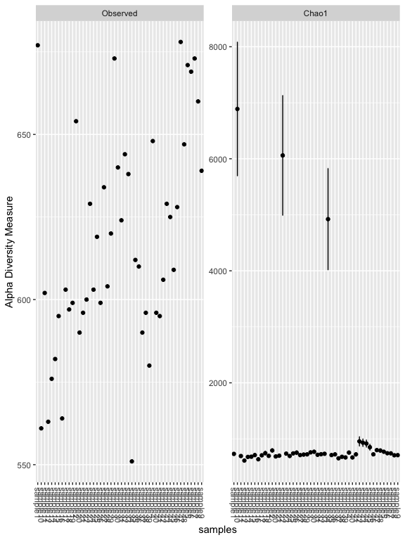<!-- -->

```r
plot_richness(s16sV3V5.4RLE, x = "Treatment", color="Timepoint", measures=c("Chao1", "Shannon"))
```

```
## Warning: Removed 48 rows containing missing values (geom_errorbar).
```

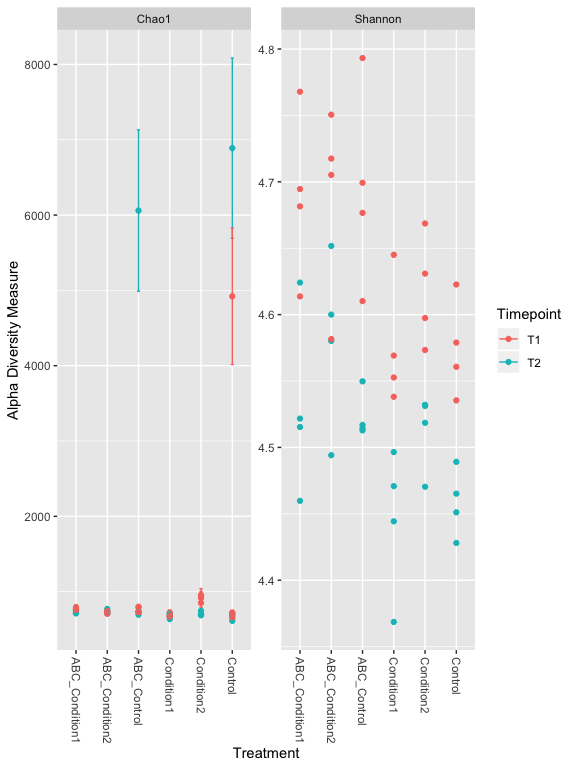<!-- -->

```r
# Other Richness measures, "Observed", "Chao1", "ACE", "Shannon", "Simpson", "InvSimpson", "Fisher" try some of these others.

er <- estimate_richness(s16sV3V5.4RLE, measures=c("Chao1", "Shannon"))

res.aov <- aov(er$Shannon ~ Treatment + Timepoint, data = as(sample_data(s16sV3V5.4RLE),"data.frame"))
# Summary of the analysis
summary(res.aov)
```

```
##             Df Sum Sq Mean Sq F value   Pr(>F)    
## Treatment    5 0.1092 0.02185   8.072 2.26e-05 ***
## Timepoint    1 0.2078 0.20776  76.761 6.13e-11 ***
## Residuals   41 0.1110 0.00271                     
## ---
## Signif. codes:  0 '***' 0.001 '**' 0.01 '*' 0.05 '.' 0.1 ' ' 1
```


## Graphical Summaries


```r
# Subset dataset by phylum
s16sV3V5.4RLE_acidob = subset_taxa(s16sV3V5.4RLE, Phylum=="p__Acidobacteria")
title = "plot_bar; Acidobacteria-only"
plot_bar(s16sV3V5.4RLE_acidob, "Treatment", "Abundance", "Family", title=title)
```

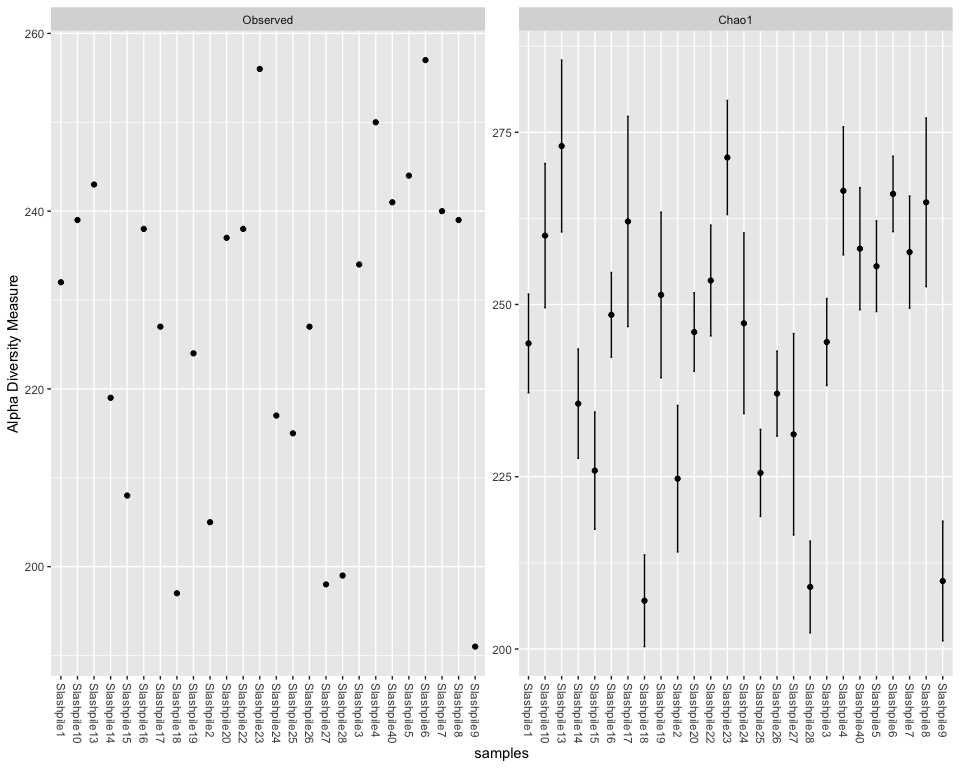<!-- -->

```r
prop  = transform_sample_counts(s16sV3V5.4, function(x) x / sum(x) )
keepTaxa <- ((apply(otu_table(prop) >= 0.005,1,sum,na.rm=TRUE) > 2) | (apply(otu_table(prop) >= 0.05, 1, sum,na.rm=TRUE) > 0))
table(keepTaxa)
```

```
## keepTaxa
## FALSE  TRUE 
##   872    60
```

```r
s16sV3V5.4RLE_trim <- prune_taxa(keepTaxa,s16sV3V5.4RLE)

plot_heatmap(s16sV3V5.4RLE_trim, "PCoA", distance="bray", sample.label="Treatment", taxa.label="Genus", low="#FFFFCC", high="#000033", na.value="white")
```

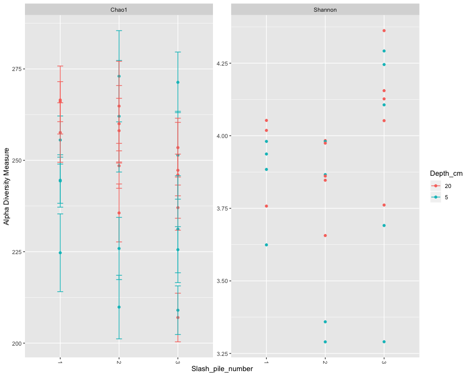<!-- -->

```r
plot_net(s16sV3V5.4RLE_trim, maxdist=0.4, color="Treatment", shape="Timepoint")
```

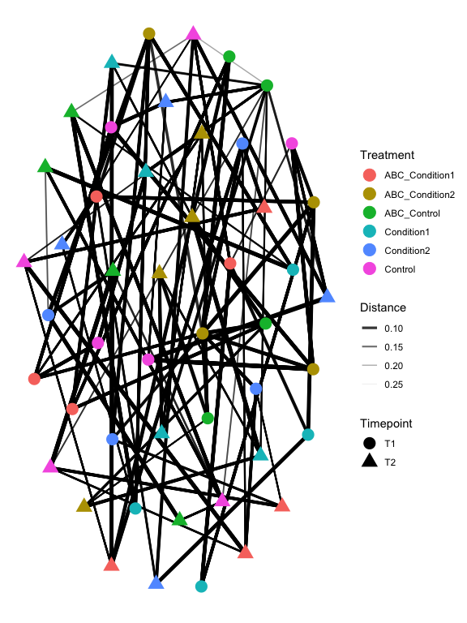<!-- -->

```r
hell.tip.labels <- as(get_variable(s16sV3V5.4RLE, "Treatment"), "character")
# This is the actual hierarchical clustering call, specifying average-linkage clustering
d <- distance(s16sV3V5.4RLE_trim, method="bray", type="samples")
RLE.hclust     <- hclust(d, method="average")
plot(RLE.hclust)
```

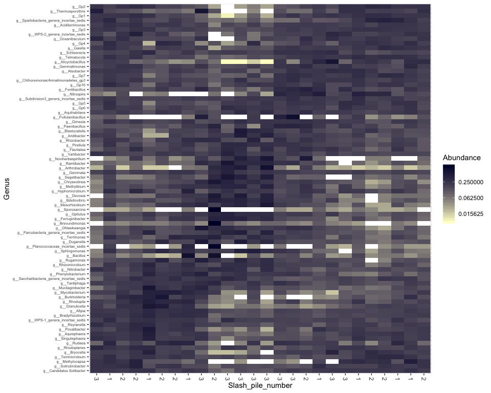<!-- -->

```r
#Lets write out a plot
pdf("My_dendro.pdf", width=7, height=7, pointsize=8)
plot(RLE.hclust)
dev.off()
```

```
## quartz_off_screen 
##                 2
```

```r
png("My_dendro.png", width = 7, height = 7, res=300, units = "in")
plot(RLE.hclust)
dev.off()
```

```
## quartz_off_screen 
##                 2
```

## Ordination


```r
v4.RLE.ord <- ordinate(s16sV3V5.4RLE_trim, "NMDS", "bray")
```

```
## Square root transformation
## Wisconsin double standardization
## Run 0 stress 0.09763903 
## Run 1 stress 0.09764394 
## ... Procrustes: rmse 0.0007765653  max resid 0.003487272 
## ... Similar to previous best
## Run 2 stress 0.09756916 
## ... New best solution
## ... Procrustes: rmse 0.006211429  max resid 0.03783506 
## Run 3 stress 0.1183573 
## Run 4 stress 0.09763896 
## ... Procrustes: rmse 0.006244267  max resid 0.03801658 
## Run 5 stress 0.09764042 
## ... Procrustes: rmse 0.006300215  max resid 0.03833707 
## Run 6 stress 0.1183573 
## Run 7 stress 0.09764753 
## ... Procrustes: rmse 0.006422066  max resid 0.03872499 
## Run 8 stress 0.116453 
## Run 9 stress 0.09756901 
## ... New best solution
## ... Procrustes: rmse 0.0004025685  max resid 0.001596649 
## ... Similar to previous best
## Run 10 stress 0.116453 
## Run 11 stress 0.09756958 
## ... Procrustes: rmse 0.0001505171  max resid 0.0007177248 
## ... Similar to previous best
## Run 12 stress 0.114047 
## Run 13 stress 0.1183522 
## Run 14 stress 0.1286158 
## Run 15 stress 0.118443 
## Run 16 stress 0.1183573 
## Run 17 stress 0.1184438 
## Run 18 stress 0.09789638 
## ... Procrustes: rmse 0.008618325  max resid 0.04188829 
## Run 19 stress 0.09756889 
## ... New best solution
## ... Procrustes: rmse 0.0003496162  max resid 0.001412773 
## ... Similar to previous best
## Run 20 stress 0.1183573 
## *** Solution reached
```

```r
p1 = plot_ordination(s16sV3V5.4RLE_trim, v4.RLE.ord, type="taxa", color="Phylum", title="taxa")
print(p1)
```

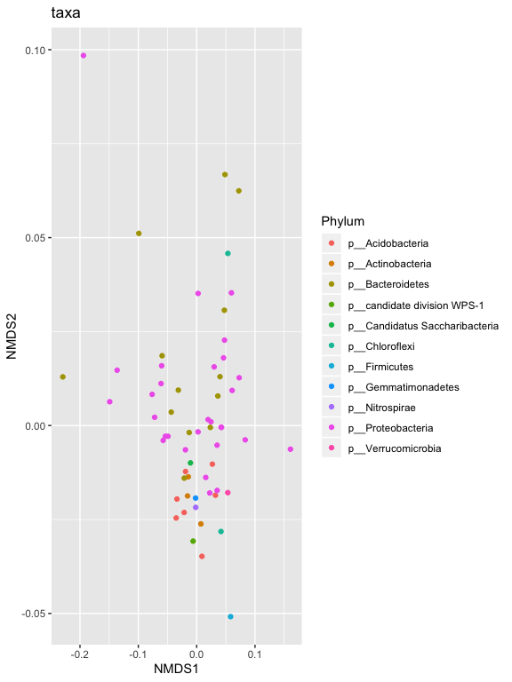<!-- -->

```r
p1 + facet_wrap(~Phylum, 5)
```

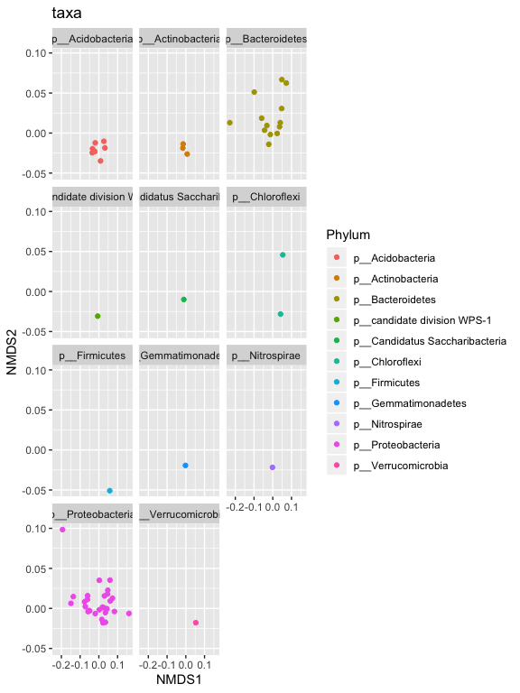<!-- -->

```r
p2 = plot_ordination(s16sV3V5.4RLE_trim, v4.RLE.ord, type="samples", color="Timepoint", shape="Treatment")
p2
```

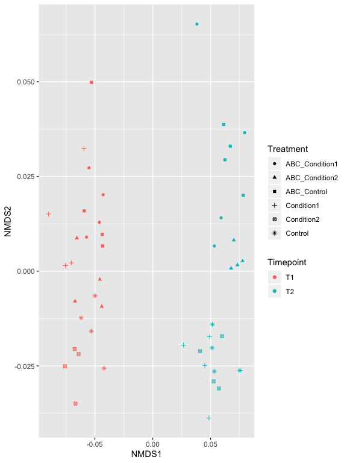<!-- -->

```r
p2 + geom_polygon(aes(fill=Treatment)) + geom_point(size=5) + ggtitle("samples")
```

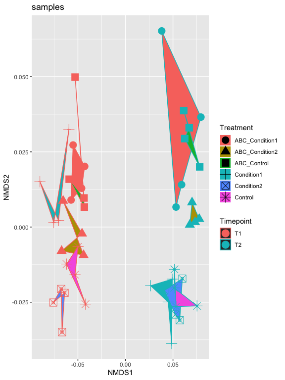<!-- -->

```r
p2
```

<!-- -->

```r
p2 = plot_ordination(s16sV3V5.4RLE_trim, v4.RLE.ord, type="biplot", color="Timepoint", shape="Treatment") +
                     scale_shape_manual(values=1:7)
p2
```

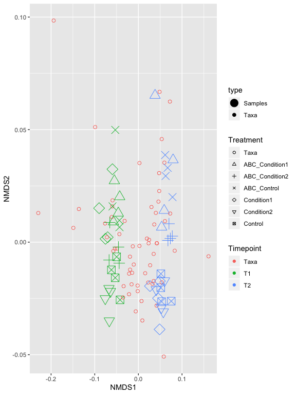<!-- -->

```r
write.table(otu_table(s16sV3V5.4RLE_trim), file = "RLE_stand_results_otu.txt",sep="\t")
```

Now try doing oridination with other transformations, such as relative abundance, log. Also looks and see if you can find any trends in the variable Dist_from_edge.

## Differential Abundances

For differential abundances we use RNAseq pipeline EdgeR and limma voom.


```r
m = as(otu_table(s16sV3V5.4), "matrix")
# Define gene annotations (`genes`) as tax_table
taxonomy = tax_table(s16sV3V5.4, errorIfNULL=FALSE)
if( !is.null(taxonomy) ){
  taxonomy = data.frame(as(taxonomy, "matrix"))
}
# Now turn into a DGEList
d = DGEList(counts=m, genes=taxonomy, remove.zeros = TRUE)

## reapply filter
prop  = transform_sample_counts(s16sV3V5.4, function(x) x / sum(x) )
keepTaxa <- ((apply(otu_table(prop) >= 0.005,1,sum,na.rm=TRUE) > 2) | (apply(otu_table(prop) >= 0.05, 1, sum,na.rm=TRUE) > 0))
table(keepTaxa)
```

```
## keepTaxa
## FALSE  TRUE 
##   872    60
```

```r
d <- d[keepTaxa,]


# Calculate the normalization factors
z = calcNormFactors(d, method="RLE")
# Check for division by zero inside `calcNormFactors`
if( !all(is.finite(z$samples$norm.factors)) ){
  stop("Something wrong with edgeR::calcNormFactors on this data,
       non-finite $norm.factors, consider changing `method` argument")
}

plotMDS(z, col = as.numeric(factor(sample_data(s16sV3V5.4)$Treatment)), labels = sample_names(s16sV3V5.4), cex=0.5)
```

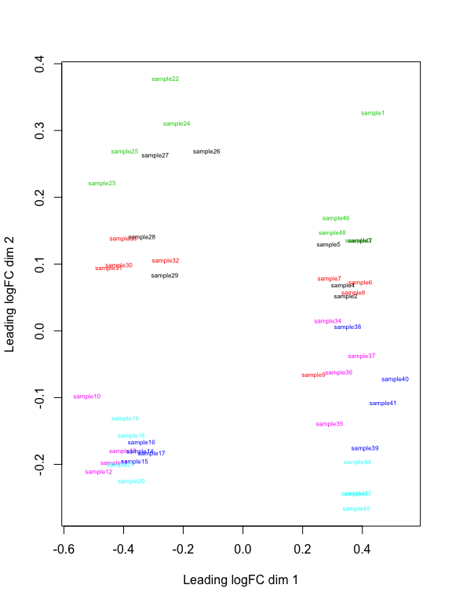<!-- -->

```r
# Creat a model based on Treatment and depth
mm <- model.matrix( ~ Treatment + Timepoint, data=data.frame(as(sample_data(s16sV3V5.4),"matrix"))) # specify model with no intercept for easier contrasts
mm
```

```
##          (Intercept) TreatmentABC_Condition2 TreatmentABC_Control
## sample1            1                       0                    1
## sample10           1                       0                    0
## sample11           1                       0                    0
## sample12           1                       0                    0
## sample13           1                       0                    0
## sample14           1                       0                    0
## sample15           1                       0                    0
## sample16           1                       0                    0
## sample17           1                       0                    0
## sample18           1                       0                    0
## sample19           1                       0                    0
## sample2            1                       0                    0
## sample20           1                       0                    0
## sample21           1                       0                    0
## sample22           1                       0                    1
## sample23           1                       0                    1
## sample24           1                       0                    1
## sample25           1                       0                    1
## sample26           1                       0                    0
## sample27           1                       0                    0
## sample28           1                       0                    0
## sample29           1                       0                    0
## sample3            1                       0                    0
## sample30           1                       1                    0
## sample31           1                       1                    0
## sample32           1                       1                    0
## sample33           1                       1                    0
## sample34           1                       0                    0
## sample35           1                       0                    0
## sample36           1                       0                    0
## sample37           1                       0                    0
## sample38           1                       0                    0
## sample39           1                       0                    0
## sample4            1                       0                    0
## sample40           1                       0                    0
## sample41           1                       0                    0
## sample42           1                       0                    0
## sample43           1                       0                    0
## sample44           1                       0                    0
## sample45           1                       0                    0
## sample46           1                       0                    1
## sample47           1                       0                    1
## sample48           1                       0                    1
## sample5            1                       0                    0
## sample6            1                       1                    0
## sample7            1                       1                    0
## sample8            1                       1                    0
## sample9            1                       1                    0
##          TreatmentCondition1 TreatmentCondition2 TreatmentControl
## sample1                    0                   0                0
## sample10                   0                   0                1
## sample11                   0                   0                1
## sample12                   0                   0                1
## sample13                   0                   0                1
## sample14                   1                   0                0
## sample15                   1                   0                0
## sample16                   1                   0                0
## sample17                   1                   0                0
## sample18                   0                   1                0
## sample19                   0                   1                0
## sample2                    0                   0                0
## sample20                   0                   1                0
## sample21                   0                   1                0
## sample22                   0                   0                0
## sample23                   0                   0                0
## sample24                   0                   0                0
## sample25                   0                   0                0
## sample26                   0                   0                0
## sample27                   0                   0                0
## sample28                   0                   0                0
## sample29                   0                   0                0
## sample3                    0                   0                0
## sample30                   0                   0                0
## sample31                   0                   0                0
## sample32                   0                   0                0
## sample33                   0                   0                0
## sample34                   0                   0                1
## sample35                   0                   0                1
## sample36                   0                   0                1
## sample37                   0                   0                1
## sample38                   1                   0                0
## sample39                   1                   0                0
## sample4                    0                   0                0
## sample40                   1                   0                0
## sample41                   1                   0                0
## sample42                   0                   1                0
## sample43                   0                   1                0
## sample44                   0                   1                0
## sample45                   0                   1                0
## sample46                   0                   0                0
## sample47                   0                   0                0
## sample48                   0                   0                0
## sample5                    0                   0                0
## sample6                    0                   0                0
## sample7                    0                   0                0
## sample8                    0                   0                0
## sample9                    0                   0                0
##          TimepointT2
## sample1            0
## sample10           1
## sample11           1
## sample12           1
## sample13           1
## sample14           1
## sample15           1
## sample16           1
## sample17           1
## sample18           1
## sample19           1
## sample2            0
## sample20           1
## sample21           1
## sample22           1
## sample23           1
## sample24           1
## sample25           1
## sample26           1
## sample27           1
## sample28           1
## sample29           1
## sample3            0
## sample30           1
## sample31           1
## sample32           1
## sample33           1
## sample34           0
## sample35           0
## sample36           0
## sample37           0
## sample38           0
## sample39           0
## sample4            0
## sample40           0
## sample41           0
## sample42           0
## sample43           0
## sample44           0
## sample45           0
## sample46           0
## sample47           0
## sample48           0
## sample5            0
## sample6            0
## sample7            0
## sample8            0
## sample9            0
## attr(,"assign")
## [1] 0 1 1 1 1 1 2
## attr(,"contrasts")
## attr(,"contrasts")$Treatment
## [1] "contr.treatment"
## 
## attr(,"contrasts")$Timepoint
## [1] "contr.treatment"
```

```r
y <- voom(d, mm, plot = T)
```

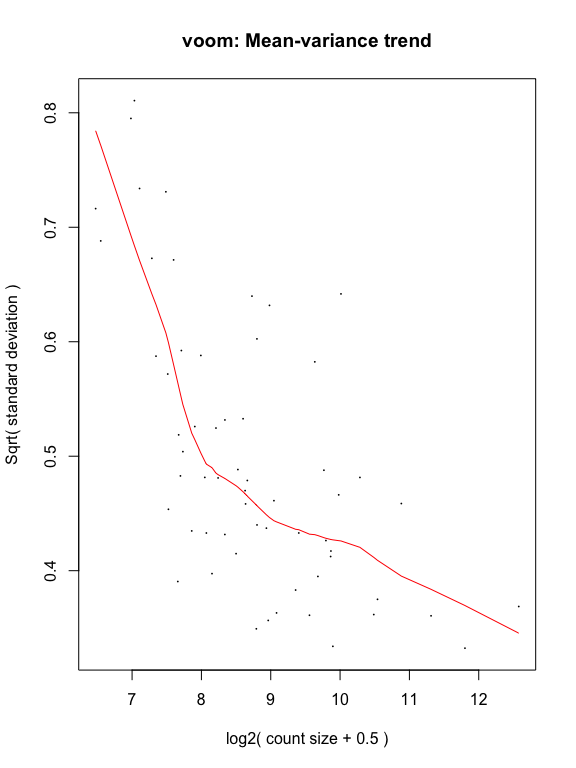<!-- -->

```r
fit <- lmFit(y, mm)
head(coef(fit))
```

```
##            (Intercept) TreatmentABC_Condition2 TreatmentABC_Control
## Taxa_00004    11.42021              0.56154953          0.247251333
## Taxa_00028    14.43708              0.09255719          0.004571592
## Taxa_00031    13.57321              0.04341135          0.200015067
## Taxa_00032    11.90593              0.06808778          0.201142692
## Taxa_00033    13.78071             -0.01281357         -0.053679539
## Taxa_00036    16.58393             -0.01195907          0.010459057
##            TreatmentCondition1 TreatmentCondition2 TreatmentControl
## Taxa_00004           0.2225633          0.33218576        0.6937022
## Taxa_00028           0.2066517          0.18367808        0.2417164
## Taxa_00031           0.1464268          0.22360593        0.1845047
## Taxa_00032           0.4280512          0.42465403        0.4160526
## Taxa_00033           0.2197528          0.45398019        0.3521470
## Taxa_00036           0.1600282         -0.03887503        0.1554179
##            TimepointT2
## Taxa_00004 -0.47590364
## Taxa_00028  0.31347126
## Taxa_00031 -0.25043174
## Taxa_00032 -0.23676668
## Taxa_00033  0.06211118
## Taxa_00036  0.24498846
```

```r
# single contrast comparing Timepoint 5 - 20
contr <- makeContrasts(TimpointT2vT1 = "TimepointT2",
                       levels = colnames(coef(fit)))
```

```
## Warning in makeContrasts(TimpointT2vT1 = "TimepointT2", levels =
## colnames(coef(fit))): Renaming (Intercept) to Intercept
```

```r
tmp <- contrasts.fit(fit, contr)
```

```
## Warning in contrasts.fit(fit, contr): row names of contrasts don't match
## col names of coefficients
```

```r
tmp <- eBayes(tmp)
tmp2 <- topTable(tmp, coef=1, sort.by = "P", n = Inf)
tmp2$Taxa <- rownames(tmp2)
tmp2 <- tmp2[,c("Taxa","logFC","AveExpr","P.Value","adj.P.Val")]
length(which(tmp2$adj.P.Val < 0.05)) # number of Differentially abundant taxa
```

```
## [1] 48
```

```r
# 48
sigtab = cbind(as(tmp2, "data.frame"), as(tax_table(s16sV3V5.4)[rownames(tmp2), ], "matrix"))
```

## One last plot


```r
theme_set(theme_bw())
scale_fill_discrete <- function(palname = "Set1", ...) {
    scale_fill_brewer(palette = palname, ...)
}
sigtabgen = subset(sigtab, !is.na(Genus))
# Phylum order
x = tapply(sigtabgen$logFC, sigtabgen$Phylum, function(x) max(x))
x = sort(x, TRUE)
sigtabgen$Phylum = factor(as.character(sigtabgen$Phylum), levels = names(x))
# Genus order
x = tapply(sigtabgen$logFC, sigtabgen$Genus, function(x) max(x))
x = sort(x, TRUE)
sigtabgen$Genus = factor(as.character(sigtabgen$Genus), levels = names(x))
ggplot(sigtabgen, aes(x = Genus, y = logFC, color = Phylum)) + geom_point(size=3) +
  theme(axis.text.x = element_text(angle = -90, hjust = 0, vjust = 0.5))
```

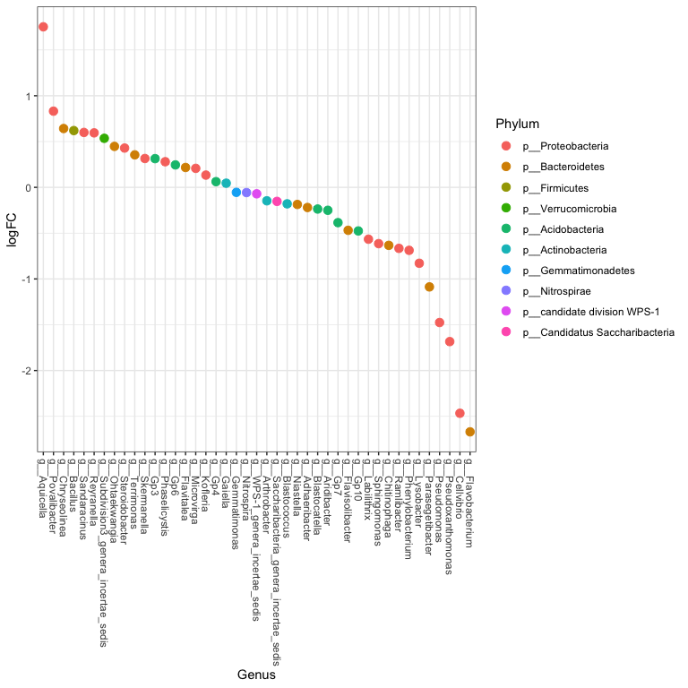<!-- -->
