# dbcAmplicons pipeline:Amplicons

## Amplicons the 'old' way

* Single PCR
* Long primer sequences (~75bp) that contain barcodes and sequencing adapters
* Single or dual barcodes
* Inline barcodes (within primary reads)

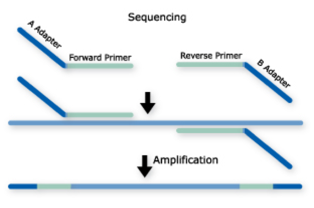

## dbcAmplicons

Originally conceived in late 2012 to lower per sample costs on relatively short, targeted (PCR) regions:
* 16S, ITS, LSU, 18S, etc.
* Community profiling
* Extraction of mitochondria, virae, chloroplast regions, plasmids by PCR.
* Genotyping of samples for phylogenomics, genome to phenotype interactions.

Uses the Illumina platform (mainly the MiSeq), capably of pooling thousands, or even tens of thousands of barcoded samples/targets per sequencing run.

Core Facility friendly, facilitates interactions between and across individual labs, standardizing workflows.

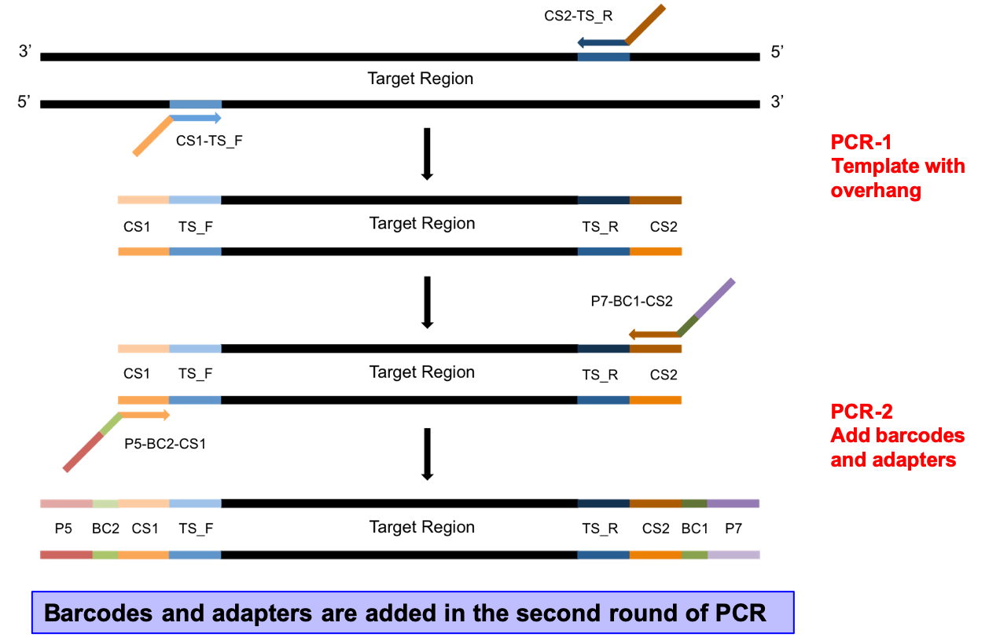

**Amplicons: Two Step PCR Approach**

* 2-step PCR, where the first PCR extracts out the target specific region and the second PCR add on adapters and barcodes. Target specific primers include universal sequences CS1 and CS2, the second PCR extends the universal sequences with adapters and barcodes.
* Adapters and barcodes are not included in the target specific primers which allows for maximum flexibility in target specific primer usage and the ability to swap out targets, or include multiple targets in the same sequencing reaction without needing to purchase a large number of barcoded, target specific primers.
* Barcodes are included in both adapters, therefor a pair of barcodes are used to uniquely identify a samples. This allows for 32 barcode pairs to be able to uniquely identify 1024 samples.

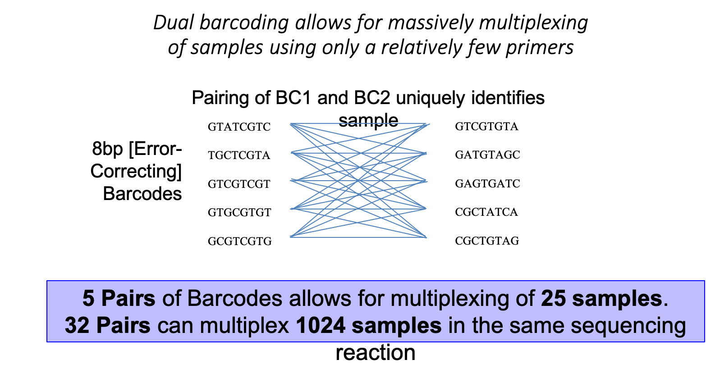

### Multiplex multiple amplicons targets

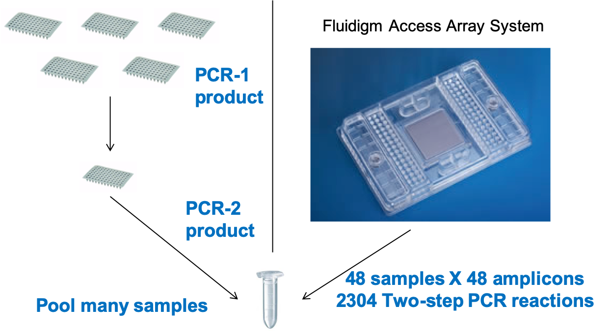

## Primer Design

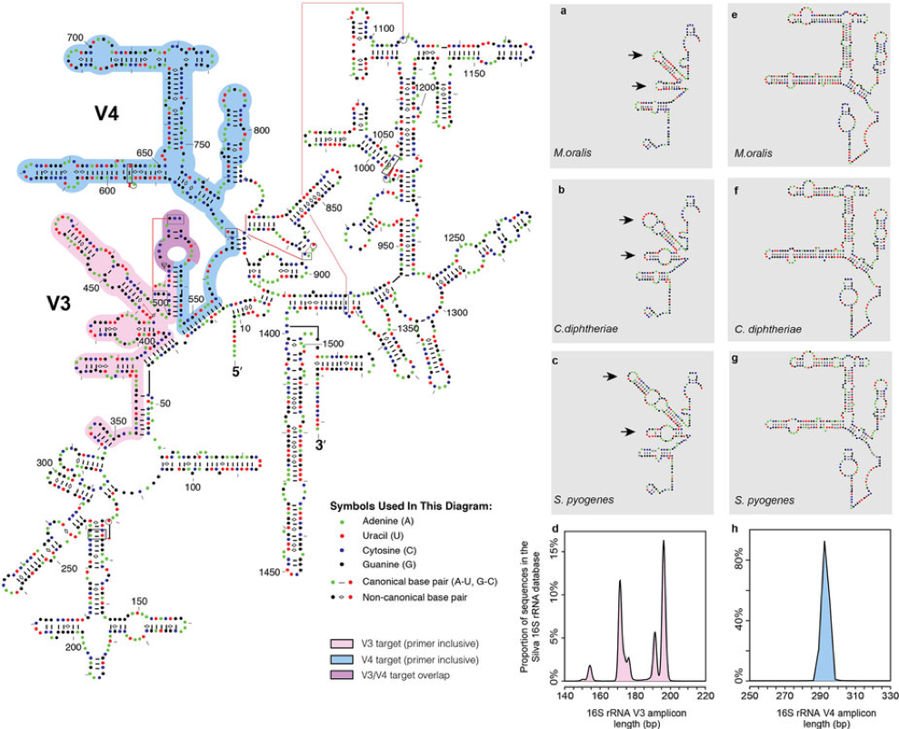
Prokaryote 16S Gene

### PCR1 Template specific primer design

Each primer pair contains the following parts
* Illumina primers (Illumina/Nextera sequences).
  * Provides the sequence necessary for priming of PCR-2, also serves as the sequencing primer site.
* Phase-shifting bases [see below]
  * Generates diversity in the sequencing reaction
* Linker sequence
  * Buffers the target specific primer sequence from the rest of the primer, preventing some taxa (longer priming) from being more efficient than others.
* Template specific primer sequence
  * Target specific primer sequence

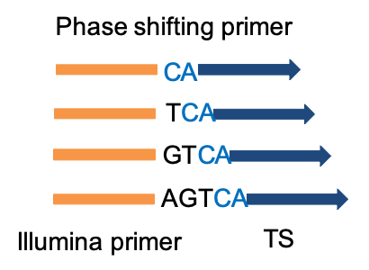

#### Examples PCR1 Template Specific Primers 16S V1-V3 (27F and 534R)

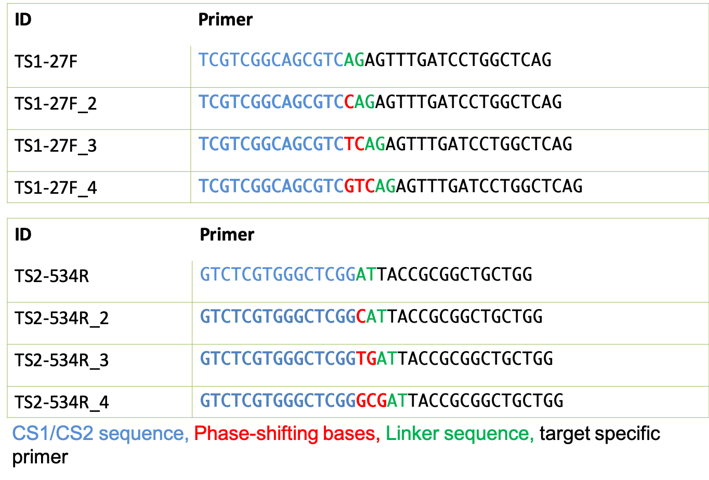

### PCR2 Barcoded Illumina Adapter Primers

* P5, or P7 sequence
  * Primers to the Illumina flow cell, Sequence on the P5 strand typically constitutes R1, those on P7 strand typically constitutes R2.
* Barcode sequence
  * Uniquely identifies sample
* Illumina primers (Illumina/Nextera sequences).
  * Necessary for extending PCR1

#### Examples PCR2 Barcoded Illumina Adapter Primers

### Final product

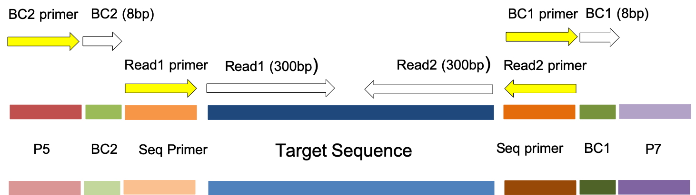

**QA/QC What is a "good" library?**

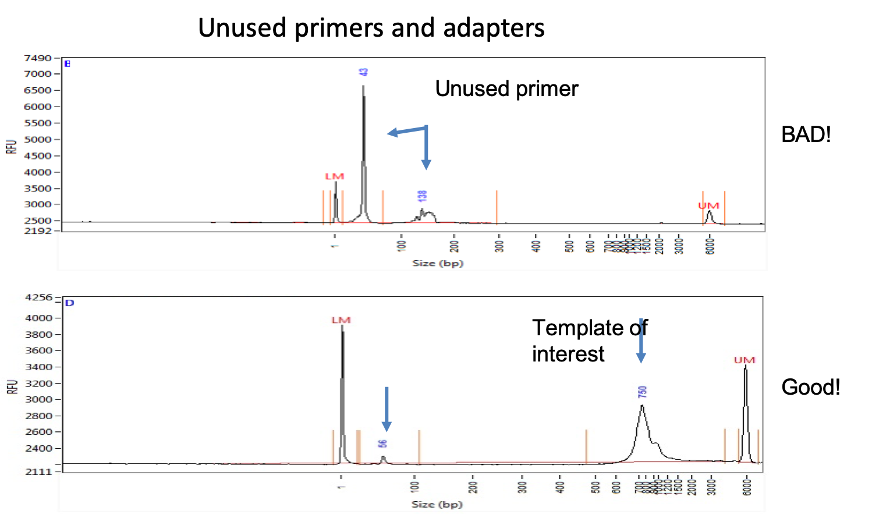

#### Benefits

* Maximum Flexibility, fewer target specific primers needed.
* Dual barcoding, allowing for massively multiplexing of samples to occur.
* Pool multiple targets per run
* Software for demultiplexing

#### DrawBacks

* Two – step PCR reaction
* Sequence the target specific primer

## Nucleotide diversity

Critically important for imaging clusters, and data quality!

Once a sample library is converted to clusters on a flow cell, “nucleotide diversity” refers to the distribution of nucleotides across the flow cell at any given cycle. From the viewpoint of the instrument software, a high diversity library translates into analyzing images containing an even distribution of spots from 4 different color channels corresponding to the 4 nucleotide bases A, T, C & G. In contrast, an unbalanced nucleotide distribution or “low diversity library” means that for any given image, or to two bases are present at a high percentage.

**LOW** Diversity Library
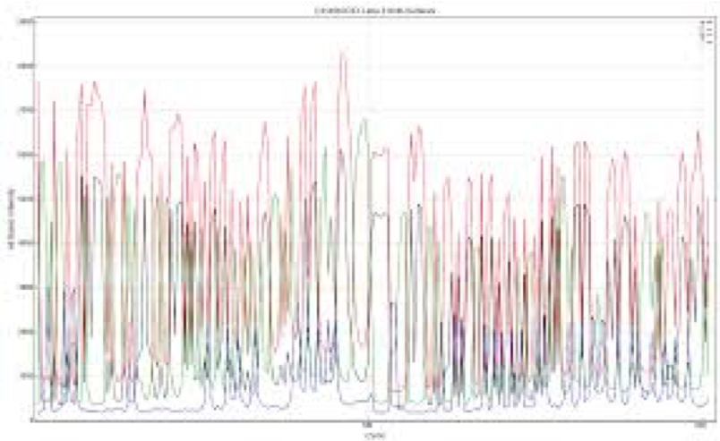

**HIGH** Diversity Library
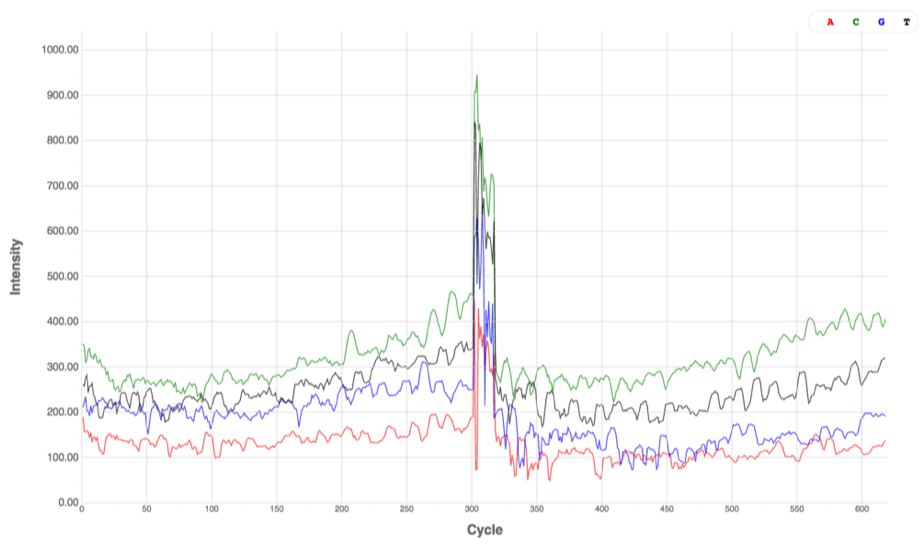

### Ways to Ensure Nucleotide Diversity

Appropriate nucleotide diversity and cluster density are important for high quality data. Low nucleotide diversity in combination with high cluster density will most-likely lead to poor data quality and/or low data yield.

* Sequence the sample at a 30-40% lower density.
* Spiking in at a 5-50% a nucleotide balanced library.
	(such as PhiX, or better a shotgun library of a sample of interest).
* Multiplex a high number of amplicon regions 12 or greater).
* Build phase-shifted primers.
* Build "flipped" primers.

Note: Experience has shown, that 15% shotgun spike-in, plus phase-shifted primers and/or multiple target region typically yields good results.
