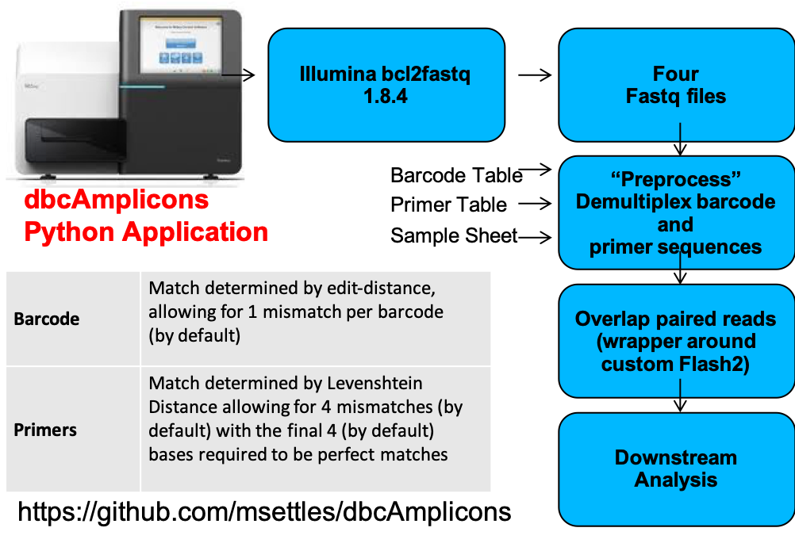
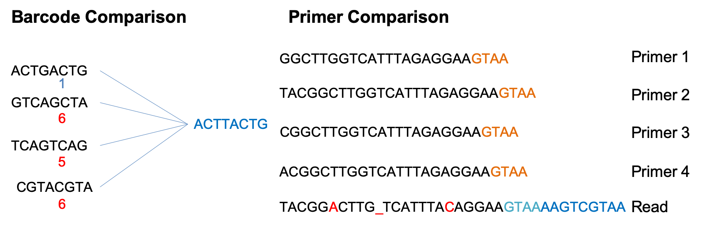
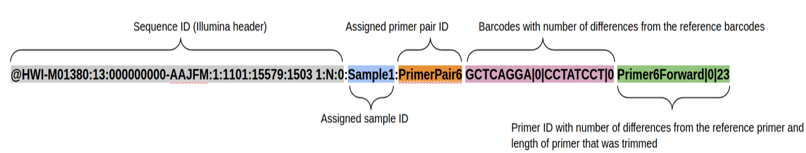
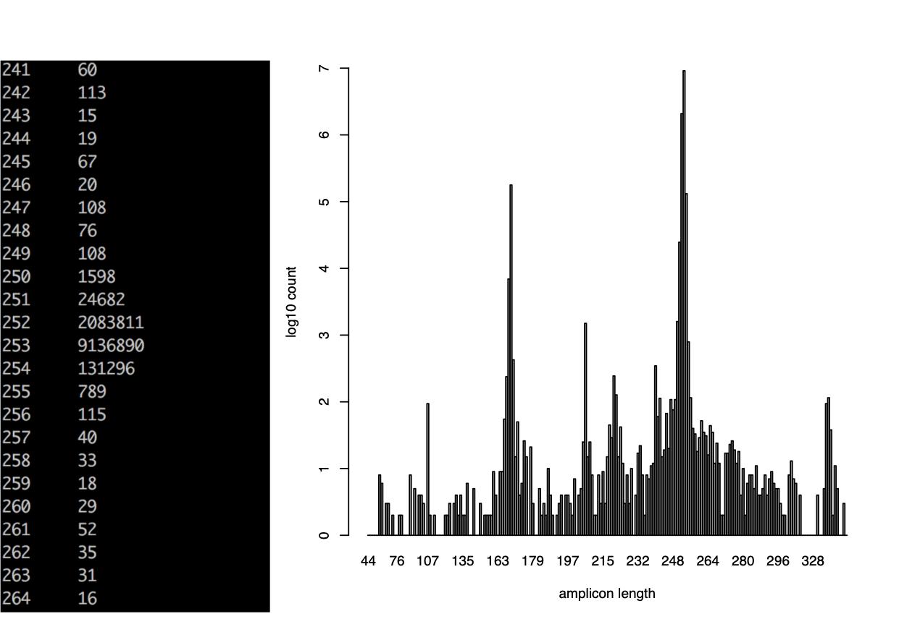

# dbcAmplicons pipeline:Bioinformatics

## Input files: barcode, primer, samples

### Barcode Table

Requires 3 columns: BarcodeID [a name for the pair], Index1 (Read2 in RC), Index2 (Read3) in a plain tab-delimited text file.
Orientation is important, but you can change in the preprocess arguments.
First line is a comment and just help me remembers.

#BarcodeID      Read2RC Read3
P7LeelaR1.P5LeelaF1	TAAGGCGA	TAGATCGC
P7LeelaR1.P5LeelaF2	TAAGGCGA	CTCTCTAT
P7LeelaR1.P5LeelaF3	TAAGGCGA	TATCCTCT
P7LeelaR1.P5LeelaF4	TAAGGCGA	AGAGTAGA
P7LeelaR1.P5LeelaF5	TAAGGCGA	GTAAGGAG
P7LeelaR1.P5LeelaF6	TAAGGCGA	ACTGCATA
P7LeelaR1.P5LeelaF7	TAAGGCGA	AAGGAGTA
P7LeelaR1.P5LeelaF8	TAAGGCGA	CTAAGCCT
P7LeelaR1.P5LeelaF9	TAAGGCGA	TGAACCTT

[Barcode table](metadata/BarcodeTable.txt) for the workshop.

### Primer Table

Requires 4 columns: the read in which the primer should be checked for (allowable are P5/P7, R1/R2, READ1/READ2, F/R,  FORWARD/REVERSE, Primer Pair ID describes which should be found ‘together’, Primer ID individual id, and sequence (IUPAC ambiguity characters are allowed).  

#Read	Pair_ID	Primer_ID	Sequence
P5	16S_V3V5	319F_1	GTACTCCTACGGGAGGCAGCAGT
P5	16S_V3V5	319F_2	CGTACTCCTACGGGAGGCAGCAGT
P5	16S_V3V5	319F_3	TCGTACTCCTACGGGAGGCAGCAGT
P5	16S_V3V5	319F_4	ATCGTACTCCTACGGGAGGCAGCAGT
P7	16S_V3V5	806R_NV1	CCGGACTACNVGGGTATCTAAT
P7	16S_V3V5	806R_NV2	GCCGGACTACNVGGGTATCTAAT
P7	16S_V3V5	806R_NV3	TGCCGGACTACNVGGGTTTCTAAT
P7	16S_V3V5	806R_NV4	ATGCCGGACTACNVGGGTTTCTAAT

[Primer table](metadata/PrimerTable.txt) for the workshop.

## Samples Table

Requires 4 columns and a header: SampleID samples name, PrimerPairID same as in primer file, barcodeID same as in barcode file, and ProjectID which represents the file prefix for the output and can include a path. SampleID, PrimerPairID, BarcodeID pairs must be unique. In addition for PrimerPairID, can be comma separated, * (match any primer), or ‘-’ should match no primer.

Additional columns are allowed and will be added to the biom file in dbcAmplicons abundances.

SampleID	PrimerPairID	BarcodeID	ProjectID	Treatment	Timepoint	Replicate
sample1	16S_V3V5	P7LeelaR9.P5LeelaF7	MCA_Workshop/workshop-6SV3V5	ABC_Control	T1	4
sample2	16S_V3V5	P7LeelaR10.P5LeelaF9	MCA_Workshop/workshop-6SV3V5	ABC_Condition1	T1	1
sample3	16S_V3V5	P7LeelaR10.P5LeelaF11	MCA_Workshop/workshop-6SV3V5	ABC_Condition1	T1	2
sample4	16S_V3V5	P7LeelaR10.P5LeelaF13	MCA_Workshop/workshop-6SV3V5	ABC_Condition1	T1	3
sample5	16S_V3V5	P7LeelaR10.P5LeelaF15	MCA_Workshop/workshop-6SV3V5	ABC_Condition1	T1	4
sample6	16S_V3V5	P7LeelaR11.P5LeelaF17	MCA_Workshop/workshop-6SV3V5	ABC_Condition2	T1	1
sample7	16S_V3V5	P7LeelaR11.P5LeelaF19	MCA_Workshop/workshop-6SV3V5	ABC_Condition2	T1	2
sample8	16S_V3V5	P7LeelaR11.P5LeelaF21	MCA_Workshop/workshop-6SV3V5	ABC_Condition2	T1	3
sample9	16S_V3V5	P7LeelaR11.P5LeelaF23	MCA_Workshop/workshop-6SV3V5	ABC_Condition2	T1	4

[Samples table](metadata/workshopSamplesheet.txt) for the workshop.

## Sequence Reads

Typically you receive fastq file(s) from the sequencing provider.

* Fastq files are actually not raw data from the provider, “raw” data is actually bcl files.
* Sequencing provider will run an application bcl2fastq with a sample sheet to produce demultiplexed (by barcode) fastq files.
* For dbcAmplicons you want to request from your sequencing provider non-demultiplexed fastq (so one set of fastqs for the entire run) with the index reads.

### fastq
fastq files combine the sequence and quality scores into 1 file. Each sequence here has 4 lines (should be enforced strictly), header, sequence, historical '+', and quality.

CASAVA 1.8 Read IDs

@EAS139:136:FC706VJ:2:2104:15343:197393 1:Y:18:ATCACG
* EAS139 the unique instrument name
* 136 the run id
* FC706VJ the flowcell id
* 2 flowcell lane
* 2104 tile number within the flowcell lane
* 15343 ’x’-coordinate of the cluster within the tile
* 197393 ’y’-coordinate of the cluster within the tile
* 1 the member of a pair, 1 or 2 (paired-end or mate-pair reads only)
* Y Y if the read fails filter (read is bad), N otherwise
* 18 0 when none of the control bits are on, otherwise it is an even number
* ATCACG index sequence

### Quality scores
Quality scores are paired 1 to 1 with sequence characters.

Each quality character has a numerical value associated with it (ASCII value). In Illumina 1.8+ you subtract 33 from the ascii value associated with the quality character to get the quality score.

# dbcAmplicons

Preprocessing reads

usage: dbcAmplicons [-h] [--version]
                    {validate,preprocess,join,screen,classify,abundance,extract}
                    ...

dbcAmplicons, a python package for preprocessing of massively multiplexed,
dual barcoded Illumina Amplicons

positional arguments:
  {validate,preprocess,join,screen,classify,abundance,extract}
                        commands
    validate            validate the sample, barcode and primer sheets
    preprocess          Preprocess four read raw amplicon data, identifying
                        barcode and primer sequence
    join                join reads using flash2
    screen              screen reads using bowtie2 and a reference sequence
                        file
    classify            classify reads using RDP generating a fixrank formated
                        file
    abundance           Generate an abundance table from a fixrank formated
                        file
    extract             extract reads corresponding to soecific taxa

optional arguments:
  -h, --help            show this help message and exit
  --version             show program's version number and exit

For questions or comments, please contact Matt Settles <settles@ucdavis.edu>
dbcAmplicons version: 0.9.1

### Application specific downstream

#### Population Community Profiling ( i.e. microbial, bacterial, fungal, etc. )
dbcAmplicons Python Application

* Screen - Using Bowtie2, screen targets against a reference fasta file, separating reads by those that produce matches and those that do not match sequences in the reference database.
* Classify - Wrapper around the MSU Ribosomal Database Project (RDP) Classifier for Bacterial and Archaeal 16S rRNA sequences, Fungal 28S rRNA, fungal ITS regions
* Abundance - Reduce RDP classifier results to abundance tables (or biom file format), rows are taxa and columns are samples ready for additional community analysis.
* Extract - Extract the reads associated with as taxonomic group for separate processing.

#### Targeted Re-sequencing
Set up R functions

* Consensus - Reduce reads to consensus sequence for each sample and amplicon.
* Most Common – Reduce reads to the most commonly occurring read in the sample and amplicon ( that is present in at least 5% and 5 reads, by default )
* Haplotypes – Impute the different haplotypes in the sample and amplicon

#### Supplemental Scripts

* convert2Readto4Read.py - For when samples are processed by someone else
* splitReadsBySample.py - To facilitate upload to the SRA
* preprocPair_with_inlineBC.py - Cut out inline BC and create 4 reads for standard input processing
Will work with ”Mills lab” protocol
* dbcVersionReport.sh - Print out version numbers of all tools

## Validate

Validate the barcode, primer and sample sheet (Must have all 3). Can be performed before data is available to check and be ready for preprocessing once available.

1. Read in the metadata input tables: Barcodes, Primers (optional), Samples (optional).
2. Validate that there are no duplicate sample/barcode/primer combos.
3. Validate that all barcodes listed in the sample sheet are in the barcode table.
4. Validate that all primers listed in the sample sheet are in the primer table.

Report any errors.

## Preprocessing

Preprocess reads for barcode and primer, match to sample sheet, only "legitimate" (contain matching barcode/primer) will be output.

1. Read in the metadata input tables: Barcodes, Primers (optional), Samples (optional)
1. Read in a batch of reads (default 100,000), for each read.
  1. Compare index barcodes to the barcode table, note best matching barcode.
  1. Compare 5’ end of reads to the primer table, note best matching primer.
  1. Compare to barcode:primer pair to the sample table, note sampleID and projectID.
  1. If its a legitimate reads (contains matching barcode,primer,sample) output the read pair to the output file.
1. Output Identified_Barcodes.txt file.

**Output:**
Preprocessed reads  
Identified_Barcodes.txt  

**Barcode Comparison** - compares each barcode to all possible barcodes and returns the best match < desired edit distance.

**Primer Comparison** - compares the beginning (primer region) of each read to all possible primers and returns the best match < specified maximimum Levenshtein distance + final 4 exact match

#### The new read header

## Join

Uses [Flash2](https://github.com/dstreett/FLASH2
) to merge reads that overlap to produce a longer (or sometimes shorter read).

Modification to original Flash algorithm include:
* Performs complete overlaps with adapter trimming
Allows for different sized reads (after cutting primer off)
* Discards reads with > 50% Q of 10 or less, which are indicative of adapter/primer dimers

**Output:**
	prefix.notCombined_1.fastq.gz    prefix.notCombined_2.fastq.gz  
	prefix.extendedFrags.fastq.gz  
	prefix.hist  
	prefix.histogram  

### Overlapping and Adapter trimming by overlapping reads.

Consider the three scenarios below

**Insert size > length of the number of cycles**

**Insert size < length of the number of cycles (10bp min)**

**Insert size < length of the read length**

Overlapping produces histograms of the overlapped Reads

## Classify

## Abundance
