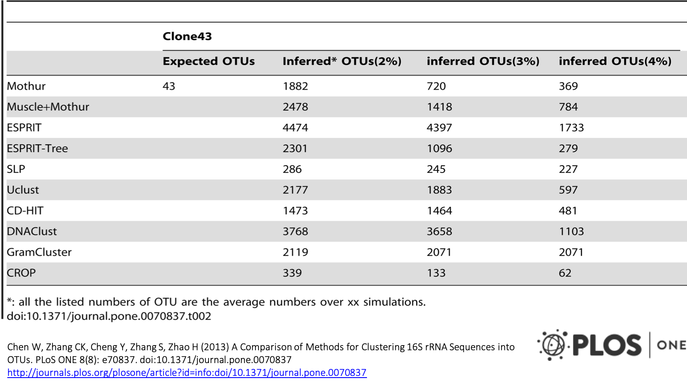
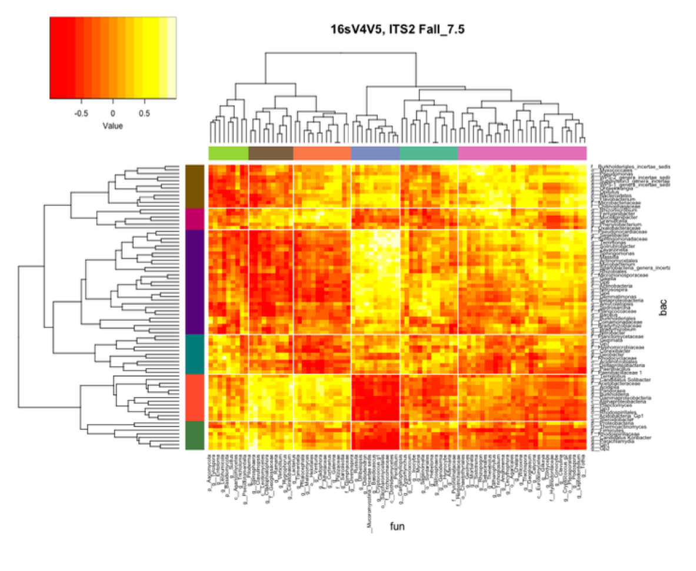

# dbcAmplicons pipeline:Bioinformatics

## Input files: barcode, primer, samples

### Barcode Table

Requires 3 columns: BarcodeID [a name for the pair], Index1 (Read2 in RC), Index2 (Read3) in a plain tab-delimited text file.
Orientation is important, but you can change in the preprocess arguments.
First line is a comment and just help me remembers.

#BarcodeID      Read2RC Read3
P7LeelaR1.P5LeelaF1	TAAGGCGA	TAGATCGC
P7LeelaR1.P5LeelaF2	TAAGGCGA	CTCTCTAT
P7LeelaR1.P5LeelaF3	TAAGGCGA	TATCCTCT
P7LeelaR1.P5LeelaF4	TAAGGCGA	AGAGTAGA
P7LeelaR1.P5LeelaF5	TAAGGCGA	GTAAGGAG
P7LeelaR1.P5LeelaF6	TAAGGCGA	ACTGCATA
P7LeelaR1.P5LeelaF7	TAAGGCGA	AAGGAGTA
P7LeelaR1.P5LeelaF8	TAAGGCGA	CTAAGCCT
P7LeelaR1.P5LeelaF9	TAAGGCGA	TGAACCTT

[Barcode table](metadata/BarcodeTable.txt) for the workshop.

### Primer Table

Requires 4 columns: the read in which the primer should be checked for (allowable are P5/P7, R1/R2, READ1/READ2, F/R,  FORWARD/REVERSE, Primer Pair ID describes which should be found ‘together’, Primer ID individual id, and sequence (IUPAC ambiguity characters are allowed).  

#Read	Pair_ID	Primer_ID	Sequence
P5	16S_V3V5	319F_1	GTACTCCTACGGGAGGCAGCAGT
P5	16S_V3V5	319F_2	CGTACTCCTACGGGAGGCAGCAGT
P5	16S_V3V5	319F_3	TCGTACTCCTACGGGAGGCAGCAGT
P5	16S_V3V5	319F_4	ATCGTACTCCTACGGGAGGCAGCAGT
P7	16S_V3V5	806R_NV1	CCGGACTACNVGGGTATCTAAT
P7	16S_V3V5	806R_NV2	GCCGGACTACNVGGGTATCTAAT
P7	16S_V3V5	806R_NV3	TGCCGGACTACNVGGGTTTCTAAT
P7	16S_V3V5	806R_NV4	ATGCCGGACTACNVGGGTTTCTAAT

[Primer table](metadata/PrimerTable.txt) for the workshop.

## Samples Table

Requires 4 columns and a header: SampleID samples name, PrimerPairID same as in primer file, barcodeID same as in barcode file, and ProjectID which represents the file prefix for the output and can include a path. SampleID, PrimerPairID, BarcodeID pairs must be unique. In addition for PrimerPairID, can be comma separated, * (match any primer), or ‘-’ should match no primer.

Additional columns are allowed and will be added to the biom file in dbcAmplicons abundances.

SampleID	PrimerPairID	BarcodeID	ProjectID	Treatment	Timepoint	Replicate
sample1	16S_V3V5	P7LeelaR9.P5LeelaF7	MCA_Workshop/workshop-6SV3V5	ABC_Control	T1	4
sample2	16S_V3V5	P7LeelaR10.P5LeelaF9	MCA_Workshop/workshop-6SV3V5	ABC_Condition1	T1	1
sample3	16S_V3V5	P7LeelaR10.P5LeelaF11	MCA_Workshop/workshop-6SV3V5	ABC_Condition1	T1	2
sample4	16S_V3V5	P7LeelaR10.P5LeelaF13	MCA_Workshop/workshop-6SV3V5	ABC_Condition1	T1	3
sample5	16S_V3V5	P7LeelaR10.P5LeelaF15	MCA_Workshop/workshop-6SV3V5	ABC_Condition1	T1	4
sample6	16S_V3V5	P7LeelaR11.P5LeelaF17	MCA_Workshop/workshop-6SV3V5	ABC_Condition2	T1	1
sample7	16S_V3V5	P7LeelaR11.P5LeelaF19	MCA_Workshop/workshop-6SV3V5	ABC_Condition2	T1	2
sample8	16S_V3V5	P7LeelaR11.P5LeelaF21	MCA_Workshop/workshop-6SV3V5	ABC_Condition2	T1	3
sample9	16S_V3V5	P7LeelaR11.P5LeelaF23	MCA_Workshop/workshop-6SV3V5	ABC_Condition2	T1	4

[Samples table](metadata/workshopSamplesheet.txt) for the workshop.

## Sequence Reads

Typically you receive fastq file(s) from the sequencing provider.

* Fastq files are actually not raw data from the provider, “raw” data is actually bcl files.
* Sequencing provider will run an application bcl2fastq with a sample sheet to produce demultiplexed (by barcode) fastq files.
* For dbcAmplicons you want to request from your sequencing provider non-demultiplexed fastq (so one set of fastqs for the entire run) with the index reads.

### fastq
fastq files combine the sequence and quality scores into 1 file. Each sequence here has 4 lines (should be enforced strictly), header, sequence, historical '+', and quality.

CASAVA 1.8 Read IDs

@EAS139:136:FC706VJ:2:2104:15343:197393 1:Y:18:ATCACG
* EAS139 the unique instrument name
* 136 the run id
* FC706VJ the flowcell id
* 2 flowcell lane
* 2104 tile number within the flowcell lane
* 15343 ’x’-coordinate of the cluster within the tile
* 197393 ’y’-coordinate of the cluster within the tile
* 1 the member of a pair, 1 or 2 (paired-end or mate-pair reads only)
* Y Y if the read fails filter (read is bad), N otherwise
* 18 0 when none of the control bits are on, otherwise it is an even number
* ATCACG index sequence

### Quality scores
Quality scores are paired 1 to 1 with sequence characters.

Each quality character has a numerical value associated with it (ASCII value). In Illumina 1.8+ you subtract 33 from the ascii value associated with the quality character to get the quality score.

# dbcAmplicons

Preprocessing reads

usage: dbcAmplicons [-h] [--version]
                    {validate,preprocess,join,screen,classify,abundance,extract}
                    ...

dbcAmplicons, a python package for preprocessing of massively multiplexed,
dual barcoded Illumina Amplicons

positional arguments:
  {validate,preprocess,join,screen,classify,abundance,extract}
                        commands
    validate            validate the sample, barcode and primer sheets
    preprocess          Preprocess four read raw amplicon data, identifying
                        barcode and primer sequence
    join                join reads using flash2
    screen              screen reads using bowtie2 and a reference sequence
                        file
    classify            classify reads using RDP generating a fixrank formated
                        file
    abundance           Generate an abundance table from a fixrank formated
                        file
    extract             extract reads corresponding to soecific taxa

optional arguments:
  -h, --help            show this help message and exit
  --version             show program's version number and exit

For questions or comments, please contact Matt Settles <settles@ucdavis.edu>
dbcAmplicons version: 0.9.1

### Application specific downstream

#### Population Community Profiling ( i.e. microbial, bacterial, fungal, etc. )
dbcAmplicons Python Application

* Screen - Using Bowtie2, screen targets against a reference fasta file, separating reads by those that produce matches and those that do not match sequences in the reference database.
* Classify - Wrapper around the MSU Ribosomal Database Project (RDP) Classifier for Bacterial and Archaeal 16S rRNA sequences, Fungal 28S rRNA, fungal ITS regions
* Abundance - Reduce RDP classifier results to abundance tables (or biom file format), rows are taxa and columns are samples ready for additional community analysis.
* Extract - Extract the reads associated with as taxonomic group for separate processing.

#### Targeted Re-sequencing
Set up R functions

* Consensus - Reduce reads to consensus sequence for each sample and amplicon.
* Most Common – Reduce reads to the most commonly occurring read in the sample and amplicon ( that is present in at least 5% and 5 reads, by default )
* Haplotypes – Impute the different haplotypes in the sample and amplicon

#### Supplemental Scripts

* convert2Readto4Read.py - For when samples are processed by someone else
* splitReadsBySample.py - To facilitate upload to the SRA
* preprocPair_with_inlineBC.py - Cut out inline BC and create 4 reads for standard input processing
Will work with ”Mills lab” protocol
* dbcVersionReport.sh - Print out version numbers of all tools

## Validate

Validate the barcode, primer and sample sheet (Must have all 3). Can be performed before data is available to check and be ready for preprocessing once available.

1. Read in the metadata input tables: Barcodes, Primers (optional), Samples (optional).
2. Validate that there are no duplicate sample/barcode/primer combos.
3. Validate that all barcodes listed in the sample sheet are in the barcode table.
4. Validate that all primers listed in the sample sheet are in the primer table.

Report any errors.

## Preprocessing

Preprocess reads for barcode and primer, match to sample sheet, only "legitimate" (contain matching barcode/primer) will be output.

1. Read in the metadata input tables: Barcodes, Primers (optional), Samples (optional)
1. Read in a batch of reads (default 100,000), for each read.
  1. Compare index barcodes to the barcode table, note best matching barcode.
  1. Compare 5’ end of reads to the primer table, note best matching primer.
  1. Compare to barcode:primer pair to the sample table, note sampleID and projectID.
  1. If its a legitimate reads (contains matching barcode,primer,sample) output the read pair to the output file.
1. Output Identified_Barcodes.txt file.

**Output:**
Preprocessed reads  
Identified_Barcodes.txt  

**Barcode Comparison** - compares each barcode to all possible barcodes and returns the best match < desired edit distance.

**Primer Comparison** - compares the beginning (primer region) of each read to all possible primers and returns the best match < specified maximimum Levenshtein distance + final 4 exact match

#### The new read header

## Join

Uses [Flash2](https://github.com/dstreett/FLASH2
) to merge reads that overlap to produce a longer (or sometimes shorter read).

Modification to original Flash algorithm include:
* Performs complete overlaps with adapter trimming
Allows for different sized reads (after cutting primer off)
* Discards reads with > 50% Q of 10 or less, which are indicative of adapter/primer dimers

**Output:**
	prefix.notCombined_1.fastq.gz    prefix.notCombined_2.fastq.gz  
	prefix.extendedFrags.fastq.gz  
	prefix.hist  
	prefix.histogram  

### Overlapping and Adapter trimming by overlapping reads.

Consider the three scenarios below

**Insert size > length of the number of cycles**

**Insert size < length of the number of cycles (10bp min)**

**Insert size < length of the read length**

Overlapping produces histograms of the overlapped Reads

## Classify

For each read determine which organism is likely came from.

* Uses the RDP (Ribosomal Database Project) classifier for bacterial and archaeal 16S, fungal LSU, ITS warcup/unite databases. You can provide your own training database

* Classifies sequences to the closest taxonomic reference provides a bootstrap score for reliability

* Concatenates Paired-end reads
  * Can trim off low quality ends, to some value Q

**Output:**
fixrank file  

M02034:401:000000000-C8N5M:1:1101:11714:1767|sample29:16S_V3V5:428              Bacteria        domain  1.0     "Proteobacteria"        phylum  1.0     Betaproteobacteria      class   0.96    Burkholderiales order   0.46    Burkholderiales_incertae_sedis  family  0.31    Thiobacter      genus   0.31
M02034:401:000000000-C8N5M:1:1101:10173:1770|sample37:16S_V3V5:424              Bacteria        domain  1.0     "Proteobacteria"        phylum  1.0     Deltaproteobacteria     class   1.0     Myxococcales    order   1.0     Nannocystaceae  family  0.94    Pseudenhygromyxa        genus   0.31
M02034:401:000000000-C8N5M:1:1101:10965:1770|sample37:16S_V3V5:424              Bacteria        domain  1.0     "Bacteroidetes" phylum  1.0     Sphingobacteriia
        class   0.78    "Sphingobacteriales"    order   0.78    "Saprospiraceae"        family  0.53    Phaeodactylibacter      genus   0.53
M02034:401:000000000-C8N5M:1:1101:17130:1771|sample48:16S_V3V5:403              Bacteria        domain  0.99    candidate division WPS-1        phylum  0.68    WPS-1_genera_incertae_sedis     class   0.68    WPS-1_genera_incertae_sedis     order   0.68    WPS-1_genera_incertae_sedis     family  0.68    WPS-1_genera_incertae_sedis     genus   0.68

### Ribosomal Database Project (RDP) - naïve Bayesian Classifier

* Compares each read to a database
* Database is updates periodically
* Compares by k-mers (15 mers)
* 100 bootstraps to establish confidence in result

**Order does not matter, no 3% !**

* Drawbacks
  * Accepts only fasta (though website implies fastq) files
  * Can be slow
  * Down to genus only (for 16s, species for ITS)
  * Kmer database are based on whole 16s
  * Cannot group together unknown OTUs that represent unique taxa

### Clustering

Clustering – “Because of the increasing sizes of today’s amplicon datasets, fast and greedy de novo clustering heuristics are the preferred and only practical approach to produce OTUs”. I DISAGREE

Shared steps in these algorithms are:
1.  An amplicon is drawn out of the amplicon pool and becomes the center of a new OTU (centroid selection)
1.  This centroid is then compared to all other amplicons remaining in the pool.
1.  Amplicons for which the distance is within a global clustering threshold, t (e.g. 3%), to the centroid are moved from the pool to the OUT
1.  The OTU is then closed. These steps are repeated as long as amplicons remain in the pool.

Why I'm not a fan
* Little to no biological rational to any of the clustering parameters, modify the parameters to get a result you like.
* Dependent on ordering, reorder our reads you can get different set of OTUs. Often not repeatable from run to run.
* 3% (or any other cutoff) is BS.
Most clustering algorithms do not consider sequencing errors.
* If you generate more data you have to start the clustering process all over again as population of sequences matters.
* I’m sure there is more

A Comparison study

## Abundance

Takes fixrank file(s) produced from classify and outputs abundance tables and taxa_info table

Abundance tables
* Rows are taxa
* Columns are samples
* Counts of the number of amplicons for each taxa/samples

Proportions tables
* Same as abundance but each cell is the proportion of amplicons (so counts in cell divided by the columns sum)

Biom file (Biological Observation Matrix)
* JSON/hd5 file format for microbiome files  
* [http://biom-format.org](http://biom-format.org)
* Abundance tables are 0 heavy, a biom file removes the 0’s as well as stores extra metadata

The [BIOM](http://biom-format.org) file format (canonically pronounced biome) is designed to be a general-use format for representing biological sample by observation contingency tables. BIOM is a recognized standard for the Earth Microbiome Project and is a Genomics Standards Consortium supported project. Contains the abundance counts, the sample names, full taxonomic string [domain through genus/species], and any sample metadata in the sample sheet.

### Abundance file

Taxon_Name	Level	sample1	sample10	sample11	sample12	sample13	sample14	sample15	sample16	sample17	sample18	sample19	sample2	sample20	sample21	sample22	sample23	sample24	sample25	sample26	sample27	sample28	sample29	sample3	sample30	sample31	sample32	sample33	sample34	sample35	sample36	sample37	sample38	sample39	sample4	sample40	sample41	sample42	sample43	sample44	sample45	sample46	sample47	sample48	sample5	sample6	sample7	sample8	sample9
Bacteria	domain	2144	2303	3235	2895	2584	2465	2907	2651	2751	3022	2904	3034	2547	2908	1946	2790	2146	2291	2046	2283	2292	2349	2483	2126	2336	2576	2478	1909	2666	2672	2605	2403	2552	2795	2073	2519	3647	3352	3559	3270	2337	2835	2258	2214	3315	3078	2848	3107
Acetothermia_genera_incertae_sedis	genus	0	0	0	0	0	0	0	0	0	0	0	0	0	0	00	0	0	0	0	0	0	0	0	0	0	0	0	0	0	0	0	0	0	0	00	0	0	0	0	0	0	0	0	1	0	0
Acidobacteria	phylum	29	18	40	36	33	42	37	35	42	25	40	19	43	34	24	32	33	23	23	21	26	34	22	27	33	33	26	28	36	28	19	34	28	39	28	30	44	34	41	29	28	21	29	28	27	35	32	35
Acidobacteria_Gp1	class	14	18	16	16	36	21	32	23	19	12	16	37	25	13	14	15	20	15	16	11	20	27	21	14	18	23	12	16	30	28	19	15	31	17	22	14	39	21	28	31	17	28	25	26	33	27	34	24
Gp10	genus	142	138	214	136	88	132	148	140	141	131	109	140	227	227	90	161	105	135	104	93	99	137	163	188	107	200	99	176	319	202	271	203	170	133	89	160	212	222	284	236	178	187	146	195	185	399	310	241
Gp11	genus	3	14	15	16	7	10	7	6	6	4	8	12	3	9	10	3	3	10	313	4	1	5	7	8	12	6	5	2	8	3	0	6	7	8	2	10	8	4	510	8	6	3	12	4	3	2
Gp12	genus	0	0	4	1	0	2	1	0	2	1	0	1	0	1	0	0	1	2	01	0	1	2	0	0	3	0	0	2	0	1	0	0	1	0	1	1	0	0	01	0	1	0	2	0	1	0
Gp13	genus	0	1	0	0	0	0	0	0	0	1	0	1	0	2	1	0	0	0	00	0	0	0	0	0	4	0	1	0	0	0	0	0	2	0	0	0	0	0	00	0	0	0	0	0	0	0
Gp15	genus	13	66	52	31	42	39	51	28	20	36	42	19	28	44	24	33	36	32	28	15	42	36	25	29	27	35	21	19	21	18	18	20	18	31	12	19	20	19	32	12	24	26	20	14	34	24	32	29

### Proportions file

Taxon_Name	Level	sample1	sample10	sample11	sample12	sample13	sample14	sample15	sample16	sample17	sample18	sample19	sample2	sample20	sample21	sample22	sample23	sample24	sample25	sample26	sample27	sample28	sample29	sample3	sample30	sample31	sample32	sample33	sample34	sample35	sample36	sample37	sample38	sample39	sample4	sample40	sample41	sample42	sample43	sample44	sample45	sample46	sample47	sample48	sample5	sample6	sample7	sample8	sample9
Bacteria	domain	0.0402274049196	0.0489947877885	0.0496196085649	0.0535337845335	0.0501620950051	0.0449916040009	0.0449283649908	0.045650227304	0.0440519463883	0.0485695917711	0.0463475748919	0.0512378829331	0.0443991214308	0.0471878752475	0.0444373401535	0.0472865326599	0.0442273607848	0.0436206469793	0.0363345764518	0.0410161513447	0.0454590531347	0.0415340547422	0.0412849375655	0.0391182748215	0.0444224698589	0.0418589535262	0.0424169804861	0.0458894230769	0.0456475583864	0.0469992260606	0.0496389031803	0.0432513184183	0.0484140233723	0.0441304176206	0.0425772264213	0.0473977345426	0.0484355078623	0.0427752893585	0.0442959201454	0.0480606710857	0.0442873656882	0.0459272939347	0.0433147899482	0.0356722790623	0.0491438736936	0.0433496704411	0.040628254326	0.0462957444272
Acetothermia_genera_incertae_sedis	genus	0.0	0.0	0.0	0.0	0.0	0.0	0.0	0.0	0.0	0.0	0.0	0.0	0.0	0.0	0.0	0.0	0.0	0.0	0.0	0.0	0.0	0.0	0.0	0.0	0.0	0.0	0.0	0.0	0.0	0.0	0.0	0.0	0.0	0.0	0.0	0.0	0.0	0.0	0.0	0.0	0.0	0.0	0.0	0.0	0.0	1.40837135936e-05	0.0	0.0
Acidobacteria	phylum	0.000544120682215	0.000382937985321	0.000613534572673	0.000665705092644	0.000640614990391	0.0007665912243560.000571843654854	0.000602700096432	0.000672548799821	0.000401800064288	0.000638396348373	0.000320870064512	0.0007495729177560.000551715185149	0.000548045305079	0.000542354496458	0.000680103870409	0.000437920070067	0.00040845320547	0.0003772839151290.000515678613221	0.000601174057571	0.000365794855594	0.000496798410245	0.00062754345263	0.000536236594085	0.0004450530640190.000673076923077	0.000616396137251	0.000492506859917	0.000362049581737	0.000611962058352	0.00053118834421	0.0006157732691240.000575090371344	0.000564482745644	0.00058436039099	0.00043387823335	0.000510292982849	0.000426226135011	0.000530614565370.000340202177294	0.000556301553808	0.00045113993394	0.000400266844563	0.000492929975776	0.000456497239618	0.000521516271308
Acidobacteria_Gp1	class	0.000262678950035	0.000382937985321	0.000245413829069	0.000295868930064	0.00069885271679	0.000383295612178	0.000494567485279	0.00039606006337	0.000304248266586	0.000192864030858	0.000255358539349	0.000624852230891	0.000435798207998	0.000210949923733	0.000319693094629	0.000254228670215	0.000412184163884	0.000285600045696	0.0002841413603270.000197624907925	0.000396675856324	0.000477402928071	0.000349167816704	0.000257599175683	0.000342296428707	0.0003737406564840.00020540910647	0.000384615384615	0.000513663447709	0.000492506859917	0.000362049581737	0.000269983261038	0.000588101381090.000268413989106	0.000451856720342	0.000263425281301	0.000517955801105	0.000267983614716	0.000348492768775	0.0004556210408740.00032215884326	0.000453602903059	0.000479570305007	0.000418915652944	0.000489215032244	0.000380260267027	0.0004850283170940.000357611157468
Gp10	genus	0.00266431506464	0.00293585788746	0.0032824099638	0.00251488590554	0.00170830664104	0.00240928670512	0.00228737461941	0.00241080038573	0.0022578423994	0.00210543233687	0.00173963004932	0.00236430573851	0.00395704772862	0.003683510206730.00205516989404	0.0027287210603	0.00216396686039	0.00257040041126	0.00184691884212	0.001670828767	0.0019635454888	0.00242237782021	0.00271020733917	0.0034591889306	0.00203476210398	0.00324991875203	0.00169462512838	0.00423076923077	0.00546195466064	0.00355308520369	0.00516397035004	0.00365377346605	0.00322507208985	0.0020999447383	0.0018279658232	0.00301057464344	0.00281555461113	0.00283296964128	0.003534712369	0.00346859889181	0.00337319259414	0.00302941938828	0.00280069058124	0.00314186739708	0.00274256912015	0.00561940172385	0.0044223170088	0.00359101203958
Gp11	genus	5.6288346436e-05	0.000297840655249	0.000230075464752	0.000295868930064	0.000135888028265	0.000182521720085	0.000108186637405	0.000103320016531	9.60783999744e-05	6.42880102861e-05	0.000127679269675	0.000202654777586	5.22957849597e-050.000146042254892	0.000228352210449	5.08457340429e-05	6.18276245827e-05	0.000190400030464	5.32765050613e-05	0.0002335567093667.93351712648e-05	1.76815899286e-05	8.31351944532e-05	0.000128799587841	0.000152131746092	0.000194995125122	0.0001027045532350.000120192307692	3.42442298473e-05	0.000140716245691	5.71657234322e-05	0.0	0.000113826073759	0.000110523407279	0.00016431153467	3.76321830429e-05	0.000132809179771	0.000102088996082	4.97846812536e-05	7.3487264657e-05	0.000189505201918	0.000129600829445	0.000115096873202	4.83364214936e-05	0.000177896375361	5.63348543744e-05	4.27966162142e-05	2.9800929789e-05
Gp12	genus	0.0	0.0	6.13534572673e-05	1.8491808129e-05	0.0	3.65043440169e-05	1.5455233915e-05	0.0	3.20261333248e-051.60720025715e-05	0.0	1.68878981322e-05	0.0	1.62269172103e-05	0.0	0.0	2.06092081942e-05	3.80800060928e-05	0.0	1.79659007204e-05	0.0	1.76815899286e-05	3.32540777813e-05	0.0	0.0	4.87487812805e-05	0.0	0.0	3.42442298473e-05	0.0	1.90552411441e-05	0.0	0.0	1.57890581827e-05	0.0	1.88160915215e-05	1.32809179771e-05	0.0	0.0	0.0	1.89505201918e-05	0.0	1.91828122003e-05	0.0	2.96493958936e-05	0.0	1.42655387381e-05	0.0
Gp13	genus	0.0	2.12743325178e-05	0.0	0.0	0.0	0.0	0.0	0.0	0.0	1.60720025715e-05	0.0	1.68878981322e-05	0.0	3.24538344205e-05	2.28352210449e-05	0.0	0.0	0.0	0.0	0.0	0.0	0.0	0.0	0.0	0.0	6.49983750406e-05	0.0	2.40384615385e-05	0.0	0.0	0.0	0.0	0.0	3.15781163654e-05	0.0	0.0	0.0	0.0	0.0	0.0	0.0	0.0	0.0	0.0	0.0	0.0	0.0	0.0
Gp15	genus	0.000243916167889	0.00140410594618	0.000797594944475	0.000573246051999	0.000815328169588	0.00071183470833	0.000788216929663	0.000482160077146	0.000320261333248	0.000578592092575	0.000670316165792	0.000320870064512	0.0004880939929580.000713984357252	0.000548045305079	0.000559303074472	0.000741931494992	0.000609280097485	0.000497247380572	0.0002694885108060.00083301929828	0.000636537237428	0.000415675972266	0.000533598292485	0.000513444643061	0.000568735781605	0.0003594659363230.000456730769231	0.000359564413396	0.000316611552804	0.000342994340593	0.000359977681384	0.000341478221278	0.0004894608036630.000246467302005	0.000357505738908	0.000265618359541	0.000242461365696	0.000398277450029	0.000176369435177	0.0004548124846030.000421202695697	0.000383656244005	0.00022556996697	0.00050403973019	0.000338009126246	0.000456497239618	0.000432113481941

### Taxa Info file

Supplies extra information about the tax identified in the experiment as well as the full taxonomic path.

Taxon_Name	MeanBootstrapValue	MeanLengthMerged	PercentageAsPairs	Total
d__Bacteria	0.997	421	0.0	126506
d__Bacteria;p__Acetothermia;c__Acetothermia_genera_incertae_sedis;o__Acetothermia_genera_incertae_sedis;f__Acetothermia_genera_incertae_sedis;g__Acetothermia_genera_incertae_sedis	0.56	421	0.0	1
d__Bacteria;p__Acidobacteria	0.605	424	0.0	1483
d__Bacteria;p__Acidobacteria;c__Acidobacteria_Gp1	0.983	403	0.0	1049
d__Bacteria;p__Acidobacteria;c__Acidobacteria_Gp10;o__Gp10;f__Gp10;g__Gp10	0.98	427	0.0	8312
d__Bacteria;p__Acidobacteria;c__Acidobacteria_Gp11;o__Gp11;f__Gp11;g__Gp11	0.792	406	0.0	321
d__Bacteria;p__Acidobacteria;c__Acidobacteria_Gp12;o__Gp12;f__Gp12;g__Gp12	0.999	403	0.0	34
d__Bacteria;p__Acidobacteria;c__Acidobacteria_Gp13;o__Gp13;f__Gp13;g__Gp13	0.998	423	0.0	13
d__Bacteria;p__Acidobacteria;c__Acidobacteria_Gp15;o__Gp15;f__Gp15;g__Gp15	0.961	414	0.0	1356

## Future Directions

* dbcAmplicons is a data reduction pipeline, produces abundance/biome files, post processing most typically done in R.
* Update to python 3
* Change to allow for bcl2fastq demultiplexed files.
* Replace primer algorithm and FLASH2 with htstream.
* Include screening of diversity sample in preprocessing to get an idea of actual proportion in the pool. Available in htstream.
* Replace RDP classification with another scheme
  * Dada2 implementation of RDP classifier
* Use amplicon length in classification
* Add in ability to generate a phylo tree.
* Output data for rarefaction curves

## Post Processing

Pretty much do all of my post analysis (abundance table, Biome) in R
* Common Packages
  * [Vegan](https://github.com/vegandevs/vegan)
  * [Vegetarian](https://github.com/cran/vegetarian)
  * [Phyloseq](https://joey711.github.io/phyloseq/) (uses vegan, ade4, ape, picante)

Ecological Diversity Analysis
* how does the structure of taxa across samples/groups compare.

Ordination Analysis (multivariate analysis)
* Visualize the relative similarity/dissimilarity across samples, test for taxa/environment relationships

Differential Abundance Analysis (univariate analysis)
* Uses tools from RNAseq (limma, edgeR)

Visualization
* temporal
* heatmaps
* ’trees’
* more

## Multi-community Analysis
Because dbcAmplicons is suitable for multiple amplicons across multiple communities, cross community analysis is possible.

