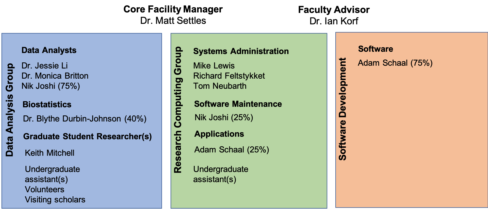

# Quick Introduction to the Workshop and Core

__The mission of the Bioinformatics Core facility is to facilitate outstanding omics-scale research through these activities:__

 

## Staff

 

## Contacts

* Bioinformatics related questions, include but not limited to bioinformatic methods questions, software use, data questions.
  * Bioinformatics.core@ucdavis.edu
* Computing Issues, include but not limited to user account questions, equipment failure/malfunction, software install, software failures (not related to use)
  * helpdesk@genomecenter.ucdavis.edu
* Training courses information
  * training.bioinformatics@ucdavis.edu

## Workshop Goals

* End to End understanding of microbial community analysis (amplicon analysis)
  * Discussions/lectures
  * Technologies
  * Experimental design
  * Cost estimation
  * Workflow
  * Microbial community analysis
* To work through a complete experiment, starting from raw data to completion, including making some figures.
* Goal is 30-40% lecture/discussion 60-70% hands-on

## Internet

You will need to access the UCD wireless via your laptop to participate in the hands-on exercises.

### Eduroam

Many academic institutions are part of Eduroam. (See "List of Institutions" under
"Members" at https://www.eduroam.us/ to find out if your institution is a member.) Please make sure you
can log into Eduroam with your device at your home institution, which will make things easier once you come to UCD.

### UCD Guest wireless

You will need to access the UCD wireless via your laptop to participate in the hands-on exercises. Please review [http://itcatalog.ucdavis.edu/service/wireless-guest-access](http://itcatalog.ucdavis.edu/service/wireless-guest-access) for access instructions.

## Workshop Materials

Workshop materials are all posted on github, and publicly available

http://bioinformatics.ucdavis.edu/training/events/

* Github main page:

	https://github.com/ucdavis-bioinformatics-training

* This Microbial Community Analysis Workshop

  https://ucdavis-bioinformatics-training.github.io/2019_September_UCD_Microbial_Community_Analysis_Workshop/  

  https://github.com/ucdavis-bioinformatics-training/2019_September_UCD_Microbial_Community_Analysis_Workshop

## Computing Cluster

Course will be conducted using the Bioinformatics Core's servers and compute cluster __tadpole.genomecenter.ucdavis.edu__

Everyone should get an account.  
https://computing.genomecenter.ucdavis.edu	 

1. Request an account -> sponsor "Bioinformatics Core Workshop". **If you already have an account on our systems, then please tell us your username**.
  *  Fill in the remainder of the information, select any username you wish
2. Confirm your email address in your email application
3. I will need to approve your account.
4. You will get an email to set your password
5. Test your account, in terminal
    ssh yourusername@tadpole.genomecenter.ucdavis.edu
  * Use the username you chose.

Cluster usage will be under the slurm reservation  ‘workshop’

Reservation will last 1 full week after the workshop and allow you to practice or run analyze your own data.

**workshop       ACTIVE  2019-09-02T00:00:00  2019-09-14T00:00:00  13-00:00:00  rafter-[8,14,18]**
